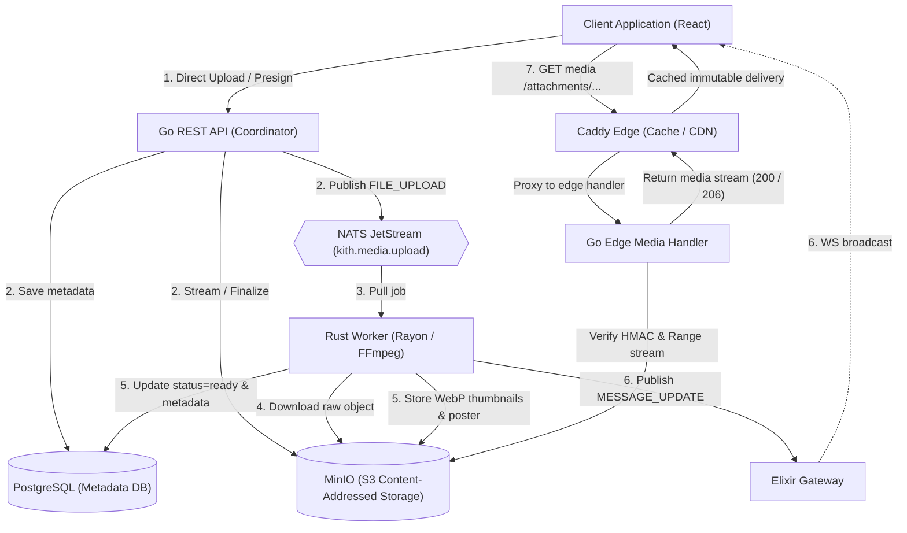
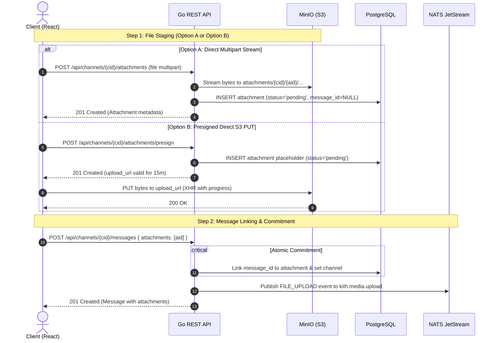
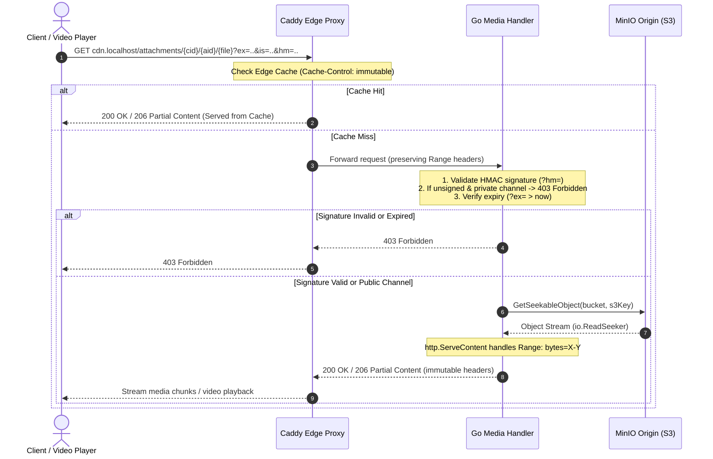

# File & Media Sharing Architecture in Kith

> Comprehensive architectural guide to file uploads, asynchronous media processing, content-addressed storage, signed URLs, and edge CDN delivery in Kith.

---

## 1. Executive Summary & Core Philosophy

Kith implements a production-grade, distributed media pipeline designed after Discord's modern media infrastructure. File and media sharing spans multiple specialized tiers:

1. **Client (React / TypeScript)**: Pre-upload state machine with XHR byte-progress tracking, CLS-free media layout reservation, lightbox, and automatic signed URL refresh.
2. **REST API & Edge Media Coordinator (Go)**: Permission validation, magic-byte MIME sniffing, content-addressed key generation, presigned S3 orchestration, and $O(1)$ stateless HMAC signature verification.
3. **Object Storage (MinIO / S3)**: Content-addressed immutable file store supporting chunked streaming and HTTP Range byte-seeking.
4. **Message Broker (NATS JetStream)**: At-least-once, durable message queue for CPU-intensive asynchronous media jobs.
5. **Media Worker (Rust)**: Rayon-threaded, memory-capped processing engine for decompression bomb defense, EXIF stripping, WebP multi-tier thumbnail generation, and FFmpeg video poster extraction.
6. **Edge CDN (Caddy)**: Reverse proxy with `cache-handler` caching immutable assets for 1 year while forwarding Range requests and delegating access control to the edge handler.



---

## 2. The Two-Step Upload Pattern

To avoid orphaned files consuming storage and to decouple large data-plane byte transfers from chat message creation, Kith enforces a **two-step upload flow**:



If a user attaches a file but cancels sending the message or navigates away, the database record retains `message_id = NULL` with `status = 'pending'`. The automated Garbage Collector ([`gc.go`](file:///home/moadabdou/coding/serious_projects/discord/api/internal/media/gc.go)) cleans up these abandoned uploads after 24 hours.

---

## 3. Ingestion Paths: Option A vs. Option B

Kith provides two ingestion mechanics configured in [`service.go`](file:///home/moadabdou/coding/serious_projects/discord/api/internal/media/service.go):

| Property | Option A: Multipart Stream via REST | Option B: Presigned Direct S3 PUT |
| :--- | :--- | :--- |
| **Endpoint** | `POST /api/channels/{cid}/attachments` | `POST /api/channels/{cid}/attachments/presign` |
| **Data Plane Path** | Client $\to$ Go REST $\to$ MinIO | Client $\to$ MinIO direct (via presigned URL) |
| **Memory Footprint** | Streaming buffer capped at $\le 32\text{ KB}$ | Zero Go REST memory / bandwidth usage |
| **Progress Tracking** | Chunked transfer (server-measured) | Browser `XMLHttpRequest.upload.onprogress` |
| **Hashing & Verification** | Streamed SHA-256 computed on the fly | Verified upon message finalization |
| **Target Use Case** | Small payloads, automated bot uploads | Large files, mobile/web clients |

### 3.1 Option A: Streaming Ingestion (REST Coordinator)
The client sends a `multipart/form-data` payload. Go's handler:
1. Validates channel permissions (`VIEW_CHANNEL` and `ATTACH_FILES`).
2. Wraps the request body in `http.MaxBytesReader` to strictly bound payload size (default $25\text{ MB}$).
3. Reads the first $512\text{ bytes}$ for MIME and security validation.
4. Uses an `io.TeeReader` coupled with `crypto/sha256` to stream data directly into a temporary MinIO key while calculating the content hash in a single pass without buffering the file in RAM.
5. Copies the object to its immutable content-addressed key and deletes the temporary key.

### 3.2 Option B: Direct-to-Storage Presigning
The client requests an authorized upload ticket:
1. Client calls `POST /api/channels/{cid}/attachments/presign` with `{ filename, content_type, byte_size }`.
2. REST generates a Snowflake ID and an S3 staging path:
   ```text
   attachments/{channel_id}/{attachment_id}/staged.{ext}
   ```
3. REST issues an S3 Presigned `PUT` URL valid for **15 minutes**.
4. Client uploads bytes directly to MinIO using `XMLHttpRequest` with progress monitoring ([`uploads.ts`](file:///home/moadabdou/coding/serious_projects/discord/client/src/lib/uploads.ts)).
5. When the user sends the message (`POST /messages`), Go's [`FinalizeAndLink`](file:///home/moadabdou/coding/serious_projects/discord/api/internal/media/service.go#L319) inspects the staged object, checks magic bytes, calculates SHA-256, copies it to the permanent content-addressed key, and links it.

---

## 4. Security, Magic Bytes & Extension Enforcement

Kith rejects files based on content inspection rather than untrusted client headers. The detection logic in [`sniffer.go`](file:///home/moadabdou/coding/serious_projects/discord/api/internal/media/sniffer.go) executes three tiers of defense:

### 4.1 Executable Magic Byte Rejection
Before MIME evaluation, raw byte signatures are checked for executable code:
- **Windows PE / DOS**: Starts with `MZ` (`0x4D, 0x5A`).
- **Linux ELF**: Starts with `0x7F, 'E', 'L', 'F'`.
- **macOS Mach-O**: Binary signatures (`0xFEEDFACE`, `0xFEEDFACF`, etc.).
- **Shell Scripts**: Starts with shebang `#!`.

Any match immediately returns `ErrDangerousFile` (`HTTP 400 Bad Request`).

### 4.2 MIME Detection & Prohibited Types
The first $512\text{ bytes}$ are inspected using `http.DetectContentType`. Prohibited types such as `application/x-executable`, `application/x-sharedlib`, `application/x-bat`, `text/x-php`, `text/x-python`, and `text/x-perl` are rejected.

### 4.3 Extension Spoofing Guard
If a client attempts to spoof a file (e.g. naming a JPEG `invoice.pdf` or an executable `avatar.png`), Kith inspects `CanonicalMIMEs`:
- If the extension does not match the sniffed format, Kith forces the canonical extension (e.g., rewriting `.png` to `.jpg`).
- If generic binary data is uploaded, dangerous extensions (`.exe`, `.dll`, `.sh`, `.ps1`, `.scr`, etc.) are blocked even if MIME detection was indeterminate.

---

## 5. Storage Addressing: Content-Addressed Immutability

Storage keys in MinIO are content-addressed:

$$\text{S3 Key} = \text{attachments}/\{\text{channel\_id}\}/\{\text{attachment\_id}\}/\{\text{sha256}\}.\{\text{ext}\}$$

### Architectural Advantages:
1. **Deduplication**: Files with identical content in the same attachment context produce identical hashes.
2. **Forever-Cacheable CDN Semantics**: Because the file content is tied to its cryptographic SHA-256 hash, an asset can never mutate. The edge CDN sets:
   ```http
   Cache-Control: public, max-age=31536000, immutable
   ```
3. **No Cache Invalidation Overhead**: Traditional CDNs require purge APIs to invalidate changed resources. In Kith, **immutability eliminates cache invalidation**. If a file changes or is re-uploaded, it produces a new hash and a new URL.

---

## 6. Asynchronous Processing Worker (Rust)

Heavy media processing is offloaded to a dedicated Rust worker ([`media-worker`](file:///home/moadabdou/coding/serious_projects/discord/media-worker)) consuming jobs over NATS JetStream.

### Why Rust?
- **Predictable Throughput**: Media decoding and transcoding are CPU-bound. Rust avoids Garbage Collection pauses on high-throughput media streams and prevents out-of-memory spikes under burst loads.
- **Rayon Parallelism**: Multi-tier image downscaling scales linearly across CPU cores.
- **Process Isolation**: Untrusted video bytes are processed via isolated subprocesses (`ffmpeg`/`ffprobe`).

### 6.1 Job Ingestion via NATS JetStream
The worker runs a durable pull consumer (`media-worker-group`) on the `KITH_MEDIA` stream (`kith.media.upload` subject) with explicit ACKs:
```json
{
  "type": "FILE_UPLOAD",
  "version": 1,
  "payload": {
    "attachment_id": "1234567890",
    "message_id": "9876543210",
    "channel_id": "111222333",
    "guild_id": "444555666",
    "content_type": "image/png",
    "s3_bucket": "attachments",
    "s3_key": "attachments/111222333/1234567890/a1b2c3...png"
  }
}
```

### 6.2 Image Processing Pipeline ([`processor.rs`](file:///home/moadabdou/coding/serious_projects/discord/media-worker/src/processor.rs))
1. **Decompression Bomb Defense**:
   - Max dimension: $8,192 \times 8,192\text{ px}$.
   - Max pixels: $36,000,000\text{ px}$.
   - Memory budget: Capped at $128\text{ MB}$.
   - Probes header dimensions before allocating full bitmap buffers.
2. **Privacy Protection (EXIF Stripping)**:
   - Untrusted metadata (GPS coordinates, device serial numbers, camera tags) is purged by decoding into raw RGB pixels and re-encoding.
3. **Parallel Multi-Tier WebP Thumbnails**:
   - Uses `rayon::par_iter()` to generate four standard tiers concurrently:
     - `80px`: Chat preview icons
     - `128px`: Mobile compact thumbnails
     - `256px`: Standard message card previews
     - `512px`: High-DPI rich previews
   - Resampling uses `FilterType::Lanczos3` for large tiers and `FilterType::Triangle` for small tiers.

### 6.3 Video Processing Pipeline ([`video.rs`](file:///home/moadabdou/coding/serious_projects/discord/media-worker/src/video.rs))
1. **RAII Temp File Lifecycle**: Writes raw bytes to a disk path wrapped in `TempFile`, ensuring automatic cleanup on drop even in panic or timeout conditions.
2. **Metadata Extraction via `ffprobe`**: Probes width, height, duration, video codec, audio codec, and bitrate with a 15-second timeout.
3. **Keyframe Extraction via `ffmpeg`**:
   - Extracts a keyframe at offset $t = 1.0\text{s}$ (or midpoint if duration $< 1.5\text{s}$).
   - Emits raw image bytes to stdout pipe (`-f image2pipe -vcodec png -`).
4. **Poster & Thumbnail Generation**: Encodes a full master poster (`poster.webp`) and 4 preview thumbnails.

### 6.4 Real-Time Client Notification
When processing completes, the worker updates PostgreSQL (`status = 'ready'`, dimensions, duration, thumbnails map). It then emits a `MESSAGE_UPDATE` event onto NATS:
```text
kith.events.{guild_id}
```
The Elixir Gateway forwards this update to connected clients in the channel. The client immediately flips the attachment from a loading spinner to the rendered media tile without a page refresh.

---

## 7. Edge CDN, Byte Ranges & Signed URLs

### 7.1 Delivery Architecture



### 7.2 Discord 2023 Signed URL Pattern
To prevent hotlinking, unauthorized sharing of private DM/vault media, and access after user bans, attachments in private channels require HMAC-SHA256 signatures ([`signer.go`](file:///home/moadabdou/coding/serious_projects/discord/api/internal/media/signer.go)):

```text
/attachments/{cid}/{aid}/{filename}?ex={expiry_hex}&is={issued_hex}&hm={hmac_hex}
```
- **`ex`**: Hex-encoded UNIX expiration timestamp ($24\text{ hours}$).
- **`is`**: Hex-encoded UNIX issuance timestamp.
- **`hm`**: $\text{HMAC-SHA256}(\text{Secret}, \text{path} + ":" + \text{ex} + ":" + \text{is})$.

### 7.3 Edge Verification Trade-Offs
- **$O(1)$ Stateless Verification**: Edge verification only computes the HMAC digest and checks `time.Now() < ex`. No database or Redis queries are executed during media streaming, protecting Postgres from read spikes.
- **Cache Key Decoupling**: Because the path is content-addressed and immutable, CDNs can strip query parameters when keying internal caches after signature verification succeeds.
- **Private Channel Awareness**:
  - DMs (`guild_id == nil`) are private by default.
  - Guild channels check channel permission overwrites for `@everyone` `VIEW_CHANNEL` denial.
  - Public channels allow fast, unsigned access to content-addressed media.

### 7.4 Video Scrubbing (HTTP 206 Partial Content)
Video players require byte-range requests (`Range: bytes=X-Y`) to scrub without downloading entire files.
- Go's `http.ServeContent` maps HTTP range headers directly onto MinIO's `io.ReadSeeker`.
- The edge returns `HTTP/1.1 206 Partial Content` with `Content-Range: bytes X-Y/Total` and `Accept-Ranges: bytes`.

---

## 8. Client-Side Presentation & UX

The frontend implementation ([`AttachmentView.tsx`](file:///home/moadabdou/coding/serious_projects/discord/client/src/components/chat/AttachmentView.tsx) and [`uploads.ts`](file:///home/moadabdou/coding/serious_projects/discord/client/src/lib/uploads.ts)) provides Discord-grade polish:

1. **Layout Stability (Cumulative Layout Shift Prevention)**:
   - When metadata is known, the container applies CSS aspect ratio styles:
     ```css
     width: min(attachment.width, 400px);
     aspect-ratio: width / height;
     max-height: 350px;
     ```
   - Chat bubbles do not jump or shift when images and videos finish loading.
2. **Media Players**:
   - **Images**: Responsive thumbnail with click-to-expand modal Lightbox.
   - **Videos**: Native HTML5 `<video>` displaying the worker-extracted `poster.webp`, custom playback controls, and a download badge.
   - **Audio**: Inline audio player with song metadata and duration.
   - **Generic Files**: File icon, filename, and formatted byte size with download trigger.
3. **Automatic URL Renewal**:
   - If an image/video fails to load due to an expired HMAC signature ($>24\text{h}$ old), the client catches `onError`, calls `GET /api/channels/{cid}/attachments/{id}` to fetch fresh signed URLs, and retries seamlessly.

---

## 9. Lifecycle Maintenance & Garbage Collection

Pending uploads that were never linked to a message are pruned by a background task running [`PruneAbandonedUploads`](file:///home/moadabdou/coding/serious_projects/discord/api/internal/media/gc.go):

```sql
SELECT id, channel_id, s3_bucket, s3_key, byte_size, thumbnails
FROM attachments
WHERE status = 'pending' 
  AND message_id IS NULL 
  AND created_at < NOW() - INTERVAL '24 hours';
```

1. Deletes raw staged files from MinIO.
2. Deletes any generated thumbnail tiers from MinIO.
3. Removes the database rows from PostgreSQL.

---

## 10. Summary Verification Matrix

Kith's automated test script ([`test_cdn_pipeline.sh`](file:///home/moadabdou/coding/serious_projects/discord/scripts/test_cdn_pipeline.sh)) continuously validates the entire media pipeline:

| Test Case | Method | Expected Result | Verified In Code |
| :--- | :--- | :--- | :--- |
| **Ingestion & Async Pipeline** | Upload video fixture via multipart | Status transitions `pending` $\to$ `ready`, poster generated | [`test_cdn_pipeline.sh:L63-75`](file:///home/moadabdou/coding/serious_projects/discord/scripts/test_cdn_pipeline.sh#L63-L75) |
| **CDN Cache Header** | `curl -sI /attachments/...` | `Cache-Control: public, max-age=31536000, immutable` | [`test_cdn_pipeline.sh:L78-86`](file:///home/moadabdou/coding/serious_projects/discord/scripts/test_cdn_pipeline.sh#L78-L86) |
| **HTTP Range Scrubbing** | `Range: bytes=0-1024` | `HTTP 206 Partial Content`, exact 1025 bytes returned | [`test_cdn_pipeline.sh:L88-113`](file:///home/moadabdou/coding/serious_projects/discord/scripts/test_cdn_pipeline.sh#L88-L113) |
| **Valid Signed URL** | Request signed private asset | `HTTP 200 OK` | [`test_cdn_pipeline.sh:L136-144`](file:///home/moadabdou/coding/serious_projects/discord/scripts/test_cdn_pipeline.sh#L136-L144) |
| **Tampered Signature** | Mutate `?hm=...` parameter | `HTTP 403 Forbidden` | [`test_cdn_pipeline.sh:L146-154`](file:///home/moadabdou/coding/serious_projects/discord/scripts/test_cdn_pipeline.sh#L146-L154) |
| **Expired Signature** | Set `?ex=1000` (past epoch) | `HTTP 403 Forbidden` | [`test_cdn_pipeline.sh:L156-164`](file:///home/moadabdou/coding/serious_projects/discord/scripts/test_cdn_pipeline.sh#L156-L164) |
| **Unsigned Private Request**| Access private asset without query params | `HTTP 403 Forbidden` | [`test_cdn_pipeline.sh:L166-174`](file:///home/moadabdou/coding/serious_projects/discord/scripts/test_cdn_pipeline.sh#L166-L174) |
