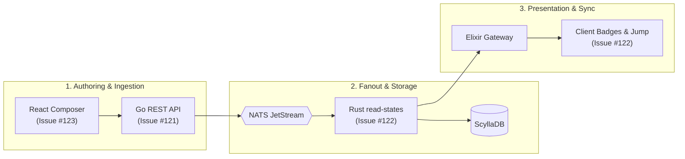
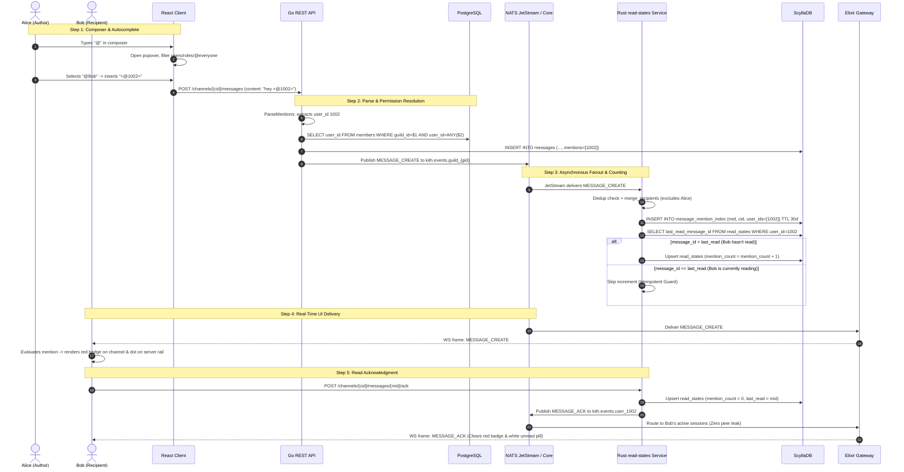
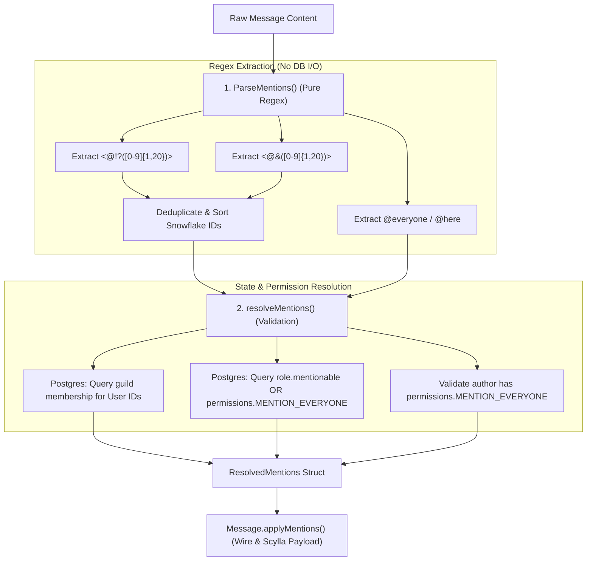
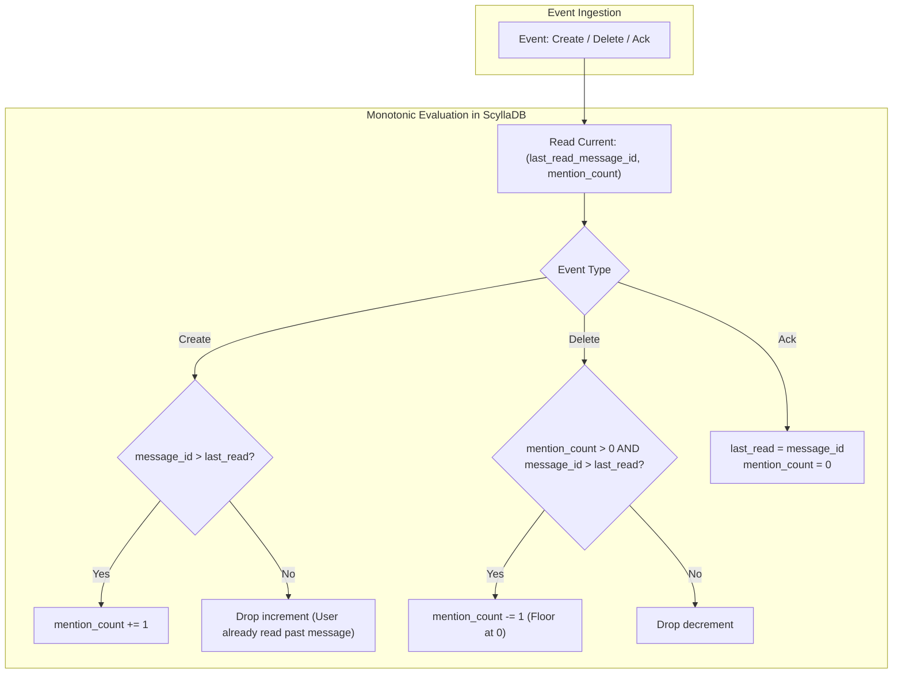

# Mentions Architecture & Lifecycle in Kith

> Comprehensive architectural guide to message mention parsing, permission resolution, asynchronous server-side counting, ephemeral deletion indexing, and client-side badge UX in Kith.

---

## 1. Executive Summary & Core Philosophy

Mentions represent one of the most operationally complex features in team chat architectures. Unlike ordinary chat messages, mentions combine:
1. **User input autocompletion** in the composer.
2. **Permission-gated resolution** (verifying role mentionability, guild membership, and broadcast rights).
3. **High-fanout recipient expansion** (`@everyone` or server-wide roles with thousands of members).
4. **Server-authoritative unread badge persistence** across sessions and devices.
5. **Monotonically safe increment/decrement lifecycles** under out-of-order network delivery and message deletions.

To deliver microsecond responsiveness at scale, Kith splits the mention lifecycle into **three decoupled tiers**:



### Key Architectural Tenets
* **Non-Mutating Content**: Message text is never altered or rewritten on the server. Unauthorized mention tokens (e.g. `<@&role>` when lacking permission) remain visible as literal text in the message body, but are omitted from authoritative mention arrays.
* **Synchronous API Path is $O(1)$**: The Go API only parses and validates mentions against immediate database records; it **never** fans out badge increments synchronously.
* **Asynchronous Off-Path Fanout**: Role expansion, `@everyone` resolution, and ScyllaDB badge increments run inside the Rust `read-states` microservice over NATS JetStream.
* **LWT-Free Monotonic Convergence**: Snowflake ID comparisons guarantee that out-of-order ACKs, creates, and deletes converge without distributed locking or Paxos transactions.
* **Ephemeral Deletion Indexing**: Mentions record exact recipient lists in ScyllaDB with a 30-day TTL (`message_mention_index`), allowing message deletions to accurately decrement unread badges without scanning guild history.

---

## 2. End-to-End System Architecture



---

## 3. Client Composer & Autocomplete (Issue #123)

### 3.1 Token Syntax
Kith follows Discord-standard mention tokens within markdown message strings:

| Mention Target | Raw Token Format | Example |
| :--- | :--- | :--- |
| **User** | `<@{user_id}>` or `<@!{user_id}>` | `<@18492049102830485>` |
| **Role** | `<@&{role_id}>` | `<@&8294019284019283>` |
| **Broadcast Everyone** | `@everyone` | `@everyone` |
| **Broadcast Here** | `@here` | `@here` |

### 3.2 Autocomplete Engine
The message composer ([`MessageInput.tsx`](file:///home/moadabdou/coding/serious_projects/discord/client/src/components/chat/MessageInput.tsx#L637-L665)) detects caret position following an `@` delimiter:
- **Filtering**: Matches query prefix against guild member display names, usernames, and role names.
- **Permission Pre-Filter**: Only displays roles marked `mentionable = true` unless the current user holds the `MENTION_EVERYONE` permission.
- **Insertion**: Replaces `@query` with the exact syntax token (e.g. `<@1002>`).
- **Input Styling**: Tokens in the input box are visually tinted with the `.chat-input-mention` CSS class ([`index.css`](file:///home/moadabdou/coding/serious_projects/discord/client/src/index.css#L1939-L1945)).

---

## 4. Server Parsing & Permission Resolution (Go API — Issue #121)

Located in [`api/internal/messages/mentions.go`](file:///home/moadabdou/coding/serious_projects/discord/api/internal/messages/mentions.go), mention resolution executes in two distinct stages before writing to storage:



### 4.1 Stage 1: Pure Syntax Extraction (`ParseMentions`)
```go
func ParseMentions(content string) ParsedMentions {
    var p ParsedMentions
    if content == "" {
        return p
    }
    p.UserIDs = distinctMentionIDs(userMentionPattern.FindAllStringSubmatch(content, -1))
    p.RoleIDs = distinctMentionIDs(roleMentionPattern.FindAllStringSubmatch(content, -1))
    p.Everyone = strings.Contains(content, "@everyone")
    p.Here = strings.Contains(content, "@here")
    return p
}
```
* **Performance**: Zero database or network overhead.
* **Determinism**: Extracted snowflakes are deduplicated using hash sets and sorted in ascending order for consistent payloads and cache keys.

### 4.2 Stage 2: Authoritative Resolution (`resolveMentions`)
Candidates extracted from the text must be authorized by guild membership and role permissions:
1. **User Membership**: Candidates must exist in the PostgreSQL `members` table for the target `guild_id`. Mentioning a user who is not in the guild strips their ID from the resolved set.
2. **Role Mentionability**:
   ```go
   // Discord semantics: role pings when mentionable, or when sender holds MENTION_EVERYONE
   if mentionable || canBroadcast {
       kept = append(kept, rid)
   }
   ```
3. **Broadcast Gating**: `@everyone` and `@here` are converted to `mention_everyone = true` **only** if the author holds `permissions.MENTION_EVERYONE`.
4. **Non-Mutating Principle**: The raw message `content` remains unmodified. Dropped mentions simply do not appear in `Message.Mentions`, `Message.MentionRoles`, or `Message.MentionEveryone`.

### 4.3 Storage Schema in ScyllaDB
Resolved mentions are persisted alongside the message in [`kith.messages`](file:///home/moadabdou/coding/serious_projects/discord/api/cql/001_create_messages.cql#L20-L22):
```sql
CREATE TABLE IF NOT EXISTS kith.messages (
    channel_id bigint,
    bucket int,
    message_id bigint,
    author_id bigint,
    content text,
    mentions list<bigint>,
    mention_roles list<bigint>,
    mention_everyone boolean,
    ...
    PRIMARY KEY ((channel_id, bucket), message_id)
) WITH CLUSTERING ORDER BY (message_id DESC);
```

---

## 5. Server-Side Mention Counting Pipeline (Rust — Issue #122)

The Rust microservice (`read-states/`) maintains server-authoritative badge counts in ScyllaDB via an asynchronous JetStream worker ([`consumer.rs`](file:///home/moadabdou/coding/serious_projects/discord/read-states/src/consumer.rs)).

### 5.1 In-Memory Deduplication (`Dedup`)
JetStream guarantees at-least-once delivery. To prevent redeliveries from inflating mention counts, the consumer maintains an in-memory FIFO dedup ring ([`consumer.rs:L66-L93`](file:///home/moadabdou/coding/serious_projects/discord/read-states/src/consumer.rs#L66-L93)):
* Bounded to `DEDUP_CAP = 10,000` keys.
* Keys are prefixed with event type (e.g. `c:{message_id}` for creates, `d:{message_id}` for deletes).

### 5.2 Recipient Expansion & Deduplication
When consuming `MESSAGE_CREATE`:
1. **Direct Mentions**: Parsed from the authoritative `mentions` array.
2. **Role Expansion**: Queries PostgreSQL (`SELECT DISTINCT user_id FROM member_roles WHERE role_id = ANY($1)`) via [`pg.rs`](file:///home/moadabdou/coding/serious_projects/discord/read-states/src/pg.rs#L62-L80).
3. **Broadcast Expansion**: If `mention_everyone == true`, queries PostgreSQL for all guild member IDs.
4. **Author Exclusion**: The message author is automatically excluded ([`merge_recipients`](file:///home/moadabdou/coding/serious_projects/discord/read-states/src/consumer.rs#L49-L64)):
   ```rust
   for id in direct.iter().chain(role_members).chain(everyone) {
       if *id > 0 && *id != author_id {
           set.insert(*id);
       }
   }
   ```

### 5.3 The Ephemeral Mention Index (`message_mention_index`)
To correctly decrement counts when a message is deleted, the service records the exact recipient list into ScyllaDB ([`db.rs`](file:///home/moadabdou/coding/serious_projects/discord/read-states/src/db.rs#L75-L89)):

```sql
CREATE TABLE IF NOT EXISTS kith.message_mention_index (
    message_id bigint PRIMARY KEY,
    channel_id bigint,
    user_ids list<bigint>
) USING TTL 2592000; -- 30 days TTL
```
* **Bounded Table Size**: The 30-day TTL guarantees that deleted messages older than 30 days do not leave orphaned index tombstones or cause perpetual table bloat.
* **Atomic Consumption**: When a delete arrives, [`take_mention_index`](file:///home/moadabdou/coding/serious_projects/discord/read-states/src/db.rs#L243-L265) reads the recipient list and issues a `DELETE` in one flow.

---

## 6. Monotonic Guards & Ordering Safety

In high-concurrency distributed systems, network delays can deliver `MESSAGE_CREATE`, `MESSAGE_ACK`, and `MESSAGE_DELETE` out of chronological order. Kith ensures convergence using monotonic Snowflake checks without distributed locks:



### 6.1 Increment Guard
[`should_count(last_read_message_id, message_id)`](file:///home/moadabdou/coding/serious_projects/discord/read-states/src/db.rs#L27-L29):
$$\text{count} \iff \text{message\_id} > \text{last\_read\_message\_id}$$
* If Bob is actively viewing Channel X, Bob's client sends periodic ACKs up to the latest Snowflake.
* If a mention arrives whose Snowflake is $\le \text{last\_read\_message\_id}$, the increment is skipped.

### 6.2 Decrement Guard
[`should_decrement(last_read_message_id, mention_count, message_id)`](file:///home/moadabdou/coding/serious_projects/discord/read-states/src/db.rs#L32-L34):
$$\text{decrement} \iff \text{mention\_count} > 0 \land \text{message\_id} > \text{last\_read\_message\_id}$$
* If Bob already read past the message, his `mention_count` was previously reset to 0 by the ACK. Deleting the message will not subtract into negative numbers.

### 6.3 ACK Overwrite
Calling `POST /channels/{cid}/messages/{mid}/ack`:
1. Sets `last_read_message_id = mid`.
2. Resets `mention_count = 0`.
3. Broadcasts `MESSAGE_ACK` to `kith.events.user_{uid}` across the user's connected WebSocket sessions.

---

## 7. Client UX & Badge State Management

The frontend maintains unread mentions in React state ([`mentionCounts.ts`](file:///home/moadabdou/coding/serious_projects/discord/client/src/lib/mentionCounts.ts) & [`App.tsx`](file:///home/moadabdou/coding/serious_projects/discord/client/src/App.tsx)):

### 7.1 State Model
```typescript
export interface MentionCountState {
  /** channel_id -> outstanding unread mention count */
  counts: Record<string, number>
  /** channel_id -> message_id of the earliest unread mention (jump target) */
  firstIds: Record<string, string>
}
```

### 7.2 Startup Hydration
On application startup, the client fetches the user's read states:
```http
GET /api/users/@me/read-states
```
ScyllaDB satisfies this query via a single-partition range scan on `user_id`. The client initializes `counts[channel_id] = state.mention_count`.

### 7.3 Badge Presentation
* **Channel Badge (`.channel-mention-badge`)**: A prominent red badge showing the unread mention count beside the channel name in the sidebar. Coexists with the white unread indicator pill.
* **Server Rail Badge (`.server-mention-dot`)**: When $\sum_{c \in \text{guild}} \text{counts}[c] > 0$, a red notification dot appears alongside the server icon in the left-hand rail.
* **Chat Area Highlight (`.message-card.message-mentioned`)**: Messages mentioning the active user render with an amber accent border and background highlight.
* **Jump to Mention**: Clicking the red sidebar mention badge triggers `handleJumpToMention()`, scrolling the chat viewport directly to `firstIds[channelId]`.

---

## 8. Failure Modes, Edge Cases & Recovery

| Scenario | System Behavior | Recovery / Outcome |
| :--- | :--- | :--- |
| **PostgreSQL Outage during Role Expansion** | `read-states` logs a warning and falls back to processing direct mentions only. | Direct mentions are preserved; role mentions can be cleared upon subsequent channel ACK. |
| **Out-of-Order ACK before MESSAGE_CREATE** | ACK sets `last_read = mid`. Late `MESSAGE_CREATE` arrives with older Snowflake. | `should_count` guard evaluates to `false`; increment is safely dropped. |
| **Message Deleted after 30-day TTL** | `take_mention_index` returns `None` (row expired). | Delete skips decrement safely. The user's badge was already cleared by an ACK in the intervening 30 days. |
| **Client Disconnect / Multiple Tabs** | One tab acknowledges channel -> publishes `MESSAGE_ACK` to `kith.events.user_{uid}`. | Elixir Gateway broadcasts event strictly to all sessions of that specific user, synchronizing badges instantly without peer leakage. |
| **Self-Mentions** | Author tags their own username or one of their own roles. | Filtered at two layers: Go API excludes in client heuristics, and Rust consumer strips `author_id` in `merge_recipients`. |

---

## 9. Key File Reference

* **Composer & Autocomplete**:
  * [`client/src/components/chat/MessageInput.tsx`](file:///home/moadabdou/coding/serious_projects/discord/client/src/components/chat/MessageInput.tsx) — Mention popover & caret tracking.
  * [`client/src/lib/mentions.ts`](file:///home/moadabdou/coding/serious_projects/discord/client/src/lib/mentions.ts) — Token regex helpers.
* **API Parsing & Validation**:
  * [`api/internal/messages/mentions.go`](file:///home/moadabdou/coding/serious_projects/discord/api/internal/messages/mentions.go) — `ParseMentions` and `resolveMentions`.
  * [`api/internal/messages/service.go`](file:///home/moadabdou/coding/serious_projects/discord/api/internal/messages/service.go) — Message creation and edit orchestration.
  * [`api/cql/001_create_messages.cql`](file:///home/moadabdou/coding/serious_projects/discord/api/cql/001_create_messages.cql) — ScyllaDB messages schema.
* **Rust Read-States & Counting Microservice**:
  * [`read-states/src/consumer.rs`](file:///home/moadabdou/coding/serious_projects/discord/read-states/src/consumer.rs) — JetStream durable consumer, deduplication, and fanout.
  * [`read-states/src/db.rs`](file:///home/moadabdou/coding/serious_projects/discord/read-states/src/db.rs) — ScyllaDB read state queries, guards, and `message_mention_index`.
  * [`read-states/src/pg.rs`](file:///home/moadabdou/coding/serious_projects/discord/read-states/src/pg.rs) — Role and guild membership expansion queries.
  * [`read-states/src/handlers.rs`](file:///home/moadabdou/coding/serious_projects/discord/read-states/src/handlers.rs) — ACK endpoint and virtual guild dispatch.
* **Client Badges & Navigation**:
  * [`client/src/lib/mentionCounts.ts`](file:///home/moadabdou/coding/serious_projects/discord/client/src/lib/mentionCounts.ts) — Badge state reducer and pure predicates.
  * [`client/src/App.tsx`](file:///home/moadabdou/coding/serious_projects/discord/client/src/App.tsx) — Guild-level aggregation and jump-to-mention handling.
  * [`client/src/index.css`](file:///home/moadabdou/coding/serious_projects/discord/client/src/index.css) — Mention badge, dot, and highlighted message styles.
