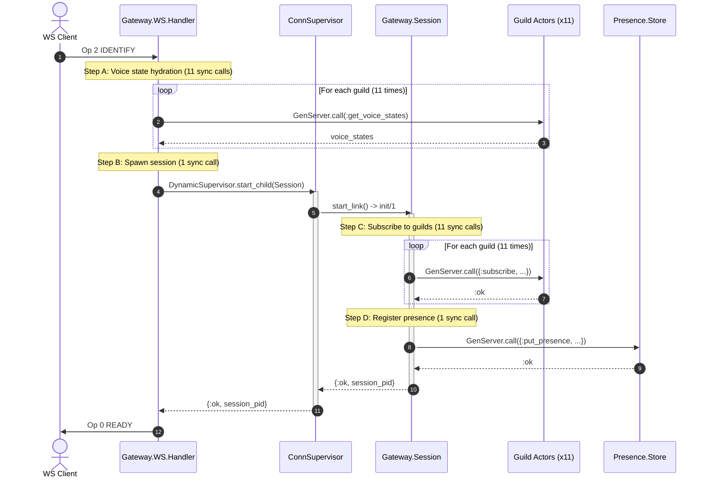

# Phase 7 Scale Bottlenecks & Architectural Solutions

> Comprehensive engineering record of the Phase 7 load army limits (diagnostic issues #88 and #89), mapped directly to the focused implementation issues (#90 through #94).

---

## Roadmap & Issue Reference Map

To prevent duplicate scopes and confusion between the overarching roadmap ([docs/load-army.md](file:///home/moadabdou/coding/serious_projects/discord/docs/load-army.md)) and specific code fixes, each discovered bottleneck maps directly to a dedicated GitHub issue:

| Target Bottleneck | Discovered During | Root Problem | Follow-up Issue |
|---|---|---|---|
| **Bottleneck A: Handshake (Birth)** | Idle Ramp & Setup | 24 sync IPC calls during IDENTIFY causing 15s timeout collapses | **[Issue #90](https://github.com/moadabdou/Kith/issues/90)** |
| **Bottleneck B: Fan-Out & Permissions** | Fan-out Test T2 (1,000 msg/s) | 30,000 ETS lookup loop in Actor + NATS 30s ack-wait redeliveries | **[Issue #91](https://github.com/moadabdou/Kith/issues/91)** |
| **Bottleneck B: Write Concurrency** | Fan-out Test T2 (1,000 msg/s) | Co-located DB pool exhaustion; 2s API POST tails | **[Issue #92](https://github.com/moadabdou/Kith/issues/92)** |
| **Bottleneck C: 10k Hot Guild** | Fan-out Test T3 (10k subs) | Single-actor serialization (> 1s tail); requires 32 lanes live proof | **[Issue #93](https://github.com/moadabdou/Kith/issues/93)** |
| **Soak & Stability (Step 5)** | Post-Fix Verification | 30-minute leak hunt for flat memory (~0 MB/min) and 0 FD growth | **[Issue #94](https://github.com/moadabdou/Kith/issues/94)** |

---

## Part 1: Bottleneck A — Birth-Side Connection Collapse (WS IDENTIFY)

### 1. The Symptom
During connection ramp-ups, the gateway successfully holds idle connections once established, but suffers **congestion collapse** whenever new connections are initiated in bursts (>= 300 connects/sec). Connections time out after 15 seconds, and effective connection intake drops to near zero.

---

### 2. The 24 Synchronous IPC Calls Breakdown

For a user belonging to N guilds (in our benchmark setup, N = 11):

```
Total Blocking IPC Calls = (2 * N_guilds) + 1 (Presence.Store) + 1 (ConnSupervisor) = 24 calls
```

#### Call Flow by Process



#### Operation Matrix

| Step | Executing Process | Target Process | Function / Message | IPC Type | Count (N=11) |
|---|---|---|---|---|---|
| **1** | `Gateway.WS.Handler` | `Gateway.Guild.Actor` (per guild) | `get_visible_voice_states/2` -> `:get_voice_states` | Synchronous `call` | **11** |
| **2** | `Gateway.WS.Handler` | `Gateway.ConnSupervisor` | `DynamicSupervisor.start_child/2` | Synchronous `call` | **1** |
| **3** | `Gateway.Session` (in `init/1`) | `Gateway.Guild.Actor` (per guild) | `subscribe/4` -> `{:subscribe, ...}` | Synchronous `call` | **11** |
| **4** | `Gateway.Session` (in `init/1`) | `Gateway.Presence.Store` | `session_connected/6` -> `{:put_presence, ...}` | Synchronous `call` | **1** |
| **Total** | | | | | **24 calls** |

Because `DynamicSupervisor.start_child` blocks until `Session.init/1` finishes executing, the client's `WS.Handler` process is **completely frozen** for the sum of all 24 calls before it can send the `READY` payload to the client.

---

### 3. Why ~5ms Per Connection is a Fatal Flaw

Under zero load (empty mailboxes), each `GenServer.call` roundtrip costs ~150 to 250 microseconds:

```
24 calls * 200 microseconds = ~4.8ms to 6.0ms per connection
```

#### The Collapse Mechanics
1. **Guild Scaling Penalty:** Handshake duration scales linearly with user guild count (10 guilds = 5ms; 100 guilds = 50ms).
2. **The Shared Mailbox Queue:** When 500 connections hit simultaneously, `500 * 2 = 1,000 messages` flood into Guild Actor #1's single mailbox at the same instant. Serial execution time for Guild #1 alone: `1,000 * 200 microseconds = 200ms` minimum wait.
3. **Compounding Queue Delays:** Each client sequentially visits 11 different guild mailboxes, compounding wait times until total handshake latency exceeds **15 seconds**.
4. **The Retry Storm:** At 15s, client socket libraries time out waiting for `READY` and disconnect. The gateway continues processing queued calls for a dead socket, while the client reconnects and pushes 24 *new* calls into the backlog. Throughput drops from 200/s to near zero.

---

### 4. Solutions (Addressed in Issue #90)

1. **ETS Direct Reads for Voice States:**
   - Guild actors write voice state updates to a shared `:gateway_voice_states` ETS table (`read_concurrency: true`).
   - `WS.Handler` performs direct memory lookups for all guilds in ~1 microsecond. Eliminates **11 blocking calls**.
2. **Asynchronous Guild Subscriptions via `handle_continue`:**
   - Move subscriptions out of `Session.init/1` into a post-init OTP callback (`handle_continue/2`).
   - `Session.init/1` returns instantly and `READY` is sent to the client immediately (< 0.1ms). Eliminates **11 blocking calls** from the critical path.
   - **Failure Handling:** If a guild subscription fails or times out inside `handle_continue`, the session does not crash. It catches `{:error, reason}` and automatically schedules the existing `:resubscribe` retry loop with backoff (1s, 3s). A failure in one guild leaves the client connected and all other guilds functional.
3. **Direct ETS / Cast for Presence Registration:**
   - Insert presence directly into `:gateway_presence_store` ETS table or use an asynchronous `cast`. Eliminates **1 blocking call**.
4. **Driver Ramp Pacing:**
   - Pace client driver connect loops to stay under the measured single-node intake ceiling (<= 120-150 births/s).

---

## Part 2: Bottleneck B — Multi-Guild Fan-Out & Ingestion Backpressure (Test T2)

### 1. The Symptom
In fan-out test **T1** (1 guild * 100 msg/s * 200 subs = 20k frames/s), the gateway passed with a 10ms server p99.
In **T2** (10 guilds * 100 msg/s = 1,000 writes/s offered):
- Delivery in-window dropped to **~15%**.
- NATS JetStream accumulated a backlog of **35,000 unread events**.
- JetStream ack timeouts fired, triggering **redelivery storms**.
- System load spiked to **55-59** with **10.8 GB swapped to disk**.

---

### 2. Root Cause Analysis

```
[1000 msg/s HTTP POSTs]
          │
          ▼
   ┌──────────────┐
   │ Go REST API  │ ──► Co-located resource starvation (POST tails: 14ms -> 2,000ms)
   └──────────────┘
          │
          ▼ (NATS JetStream)
   ┌──────────────┐
   │ NATS Broker  │ ──► 35,000 events backlogged; ack_wait (30s) timeouts trigger redeliveries
   └──────────────┘
          │
          ▼
   ┌───────────────────────┐
   │ Elixir NatsConsumer   │ ──► Mailbox grew 3,000-5,000 deep (single-process funnel)
   └───────────────────────┘
          │
          ▼
   ┌───────────────────────┐
   │ Elixir Metrics Agent  │ ──► Mailbox grew 1,600 deep (blocked on synchronous stats updates)
   └───────────────────────┘
          │
          ▼
   ┌───────────────────────┐
   │ Elixir Guild Actor    │ ──► Loops 10,000 times running 30,000 ETS lookups per message
   └───────────────────────┘
```

#### A. Ingestion & Metrics Funnel (Fixed in commit 47b33ba)
All NATS messages previously passed through a single `NatsConsumer` GenServer and updated a single `Metrics` GenServer. Queues backed up thousands deep before reaching guild actors.

#### B. NATS `ack_wait` (30s) & Redelivery Storm
In NATS JetStream (`ack_policy: "explicit"`), workers must send `+ACK` within `ack_wait = 30s`:
- When queue backlog reached 35,000 messages, queue delay exceeded 30 seconds (`35,000 * 1ms = 35s`).
- NATS assumed workers had crashed and re-sent all 35,000 messages (`delivered_count = 2`).
- Workers were now buried under 70,000 messages, entering an unrecoverable redelivery death spiral.

#### C. The Single-Actor "Permission Walk"
Inside `Gateway.Guild.Actor`:
```elixir
Enum.each(state.subscribers, fn {session_id, sub} ->
  if can_subscriber_view?(user_id, channel_id, state.real_guild_id) do
    send(pid, {:dispatch, event, bus_received_at})
  end
end)
```
- Each `can_subscriber_view?` executes **3 ETS lookups** (`get_guild`, `get_channel`, `get_member_roles`) + bitwise mask algebra.
- In a 10,000-subscriber guild, 1 message = **30,000 ETS lookups** inside a single sequential loop.
- The actor's mailbox is blocked for **> 1,000ms** per message.

#### D. API Write-Path & Database Contention
- Isolated, the Go REST API does **997 msg/s at 14ms**.
- Under T2, with Gateway fan-out running on the same 8-core CPU, POST latency exploded to **2,000ms**.
- The API's 5/5s rate limiter only tracks individual user/channel buckets; it did not protect against 120+ distinct users posting concurrently.

---

### 3. Solutions (Addressed in Issues #91 and #92)

#### A. Ingestion & Intake (Issue #91)
- **Guild-Partitioned Worker Pool:** Spread incoming events across 8 workers using `:erlang.phash2(guild_id, count)` (merged in `47b33ba`). Guarantees strict per-guild FIFO while parallelizing intake across all CPU cores.
- **Lock-Free ETS Metrics:** Replaced the `Metrics` GenServer with direct atomic ETS counters.
- **Ack Tuning & Dead Lettering:** Set `max_deliver: 3` and keep worker queue latency well below `ack_wait`.

#### B. Decentralized Permission Resolution (Issue #91)
- **Light Check (Guild Actor):** Guild Actor strips per-subscriber permission evaluation. It executes a raw pointer broadcast (`send(session_pid, event)`). Dispatch finishes in **< 2ms** for 10,000 subscribers.
- **Full Check (Session Actor):** Each `Session` process evaluates channel permissions (`can_view?`) locally in its own thread:
  ```elixir
  @impl true
  def handle_info({:dispatch, event, bus_received_at}, state) do
    channel_id = extract_channel_id(event)
    guild_id = event["guild_id"] || (is_map(event["payload"]) && event["payload"]["guild_id"])

    if can_view?(state.user_id, channel_id, guild_id) do
      push_to_ws(event, state)
    else
      {:noreply, state} # Drop silently
    end
  end
  ```
  Permission checks run **in parallel across all scheduler cores** instead of serialized in one process.

#### C. API Concurrency Protection & Load Shedding (Issue #92)
- **Fixed DB Pool:** Maintain `SetMaxOpenConns = 25` and `SetMaxIdleConns = 25` (aligns with optimal PostgreSQL execution for an 8-core DB server).
- **Server Semaphore (Fast Rejection):**
  - Limit concurrent in-flight DB operations to **50** (2x pool).
  - Requests exceeding capacity receive an immediate `429 / 503` in **0.05ms** rather than queueing in RAM and slowing to 2,000ms.
- **Horizontal Scaling:** When aggregate write volume exceeds 1,200 msg/s, scale out API replicas behind Caddy rather than pushing a single node past its knee.

#### D. Box Isolation (Stopping Swap Thrashing)
- **Stop Heavy Background Tiers:** Shut down Search Indexer and Meilisearch (which alone consume ~96% CPU) during throughput benchmarks.
- **Eliminate Disk Swap:** Keeps ETS cache tables in physical RAM, restoring memory read latencies from milliseconds (disk I/O) back to nanoseconds.

---

## Part 3: Bottleneck C — Hot Guilds (10,000 Subscribers) & 32-Lane Partitioning (Test T3)

### 1. The Symptom (The "Big Guild" Problem)
In hot community guilds with 10,000+ online members (Test **T3**):
- 4 messages broadcast into 10,000 subscribers achieved 100% frame delivery (40,000 / 40,000).
- BUT server dispatch latency spiked to **> 1,000ms** (breaching the 500ms gate), and client end-to-end latency reached **1.0 to 2.4 seconds**.
- **Root Cause:** A single GenServer actor sequentially looping over 10,000 subscriber PIDs blocks its mailbox completely for over a second. Any burst of chat messages stalls the entire guild.

---

### 2. Architecture: Control Plane vs. Data Plane Split

To break the single-actor serialization wall, large guilds (> 1,000 members) automatically activate **32 parallel lane actors**:

```
                              [NATS Message Event]
                                       │
                    ┌──────────────────┴──────────────────┐
                    ▼                                     ▼
        ┌───────────────────────┐             ┌───────────────────────┐
        │  Guild Control Actor  │             │   32 Message Lanes    │
        │  (Presences, Voice,   │             │   (CHAT MESSAGES)     │
        │   Channel Updates)    │             └───────────────────────┘
        └───────────────────────┘                         │
                    │                    ┌────────────────┼────────────────┐
                    ▼                    ▼                ▼                ▼
             All 10k Sessions        Lane 0            Lane 1         Lane 31
                                   (~312 subs)       (~312 subs)    (~312 subs)
```

1. **Control Actor (Control Plane):**
   - Owns the single-source-of-truth state: active voice states, member list, channel/role lifecycle, and the distributed Redis cluster lease.
   - Low to moderate event frequency; never blocked by chat floods.
2. **32 Lane Actors (Data Plane):**
   - Dedicated exclusively to high-frequency chat message fan-out (`MESSAGE_CREATE`, `MESSAGE_UPDATE`, `MESSAGE_DELETE`).
   - Subscribers are evenly sharded: `lane_index = rem(:erlang.phash2(session_id), 32)`.
   - Each lane only holds **~312 subscribers** (for a 10k guild) instead of 10,000.
   - Dispatch across 312 sockets completes in **< 0.1ms** per lane.

---

### 3. Zero-Loss Cutover ("Join-Then-Flag")

When a guild crosses 1,000 members and transitions into lanes:

```
Step 1: Session joins Lane 4
        Session ──(subscribe)──► Lane 4
        Session ◄─────(:ok)───── Lane 4
        (Lane 4 is now actively delivering chat messages to Session)

Step 2: Session flags Control Actor
        Session ──(note_migrated)──► Control Actor
        (Control Actor safely marks: "Session is in Lane 4; stop sending chat to it")
```

1. **Join First:** The session connects to its assigned lane and confirms active delivery.
2. **Flag Second (`note_migrated`):** The session flags the Control Actor to stop sending chat to it.
3. **Result:** Zero message gaps, zero dropped frames, and zero duplicate deliveries during transition.

---

### 4. Message Sequence Ordering (`s: 1, 2, 3...`)

- **Ownership:** The **Session process** (not the lanes) owns the monotonic sequence counter (`seq`).
- Whether an event arrives from the Control Actor (voice update) or Lane 4 (chat message), the Session receives it, stamps the next sequential number, writes it to the ring buffer for RESUME replay, and pushes to WebSocket.
- Sequence continuity is strictly preserved across all lanes.

---

### 5. Sizing & Scaling Headroom

- In Elixir, each GenServer process costs only **~2 KB of RAM**.
- **Fixed 32 Lanes:** Handles up to **50,000 members per guild** easily (~1,500 sockets per lane, taking ~1ms).
- Dynamic resizing is unnecessary at current scale.

---

### 6. Live Verification (Addressed in Issue #93)
- Live end-to-end verification runs 100 msg/s into 10,000 subscribers with paced connection ramp (<= 120-150 connects/s) to prove dispatch p99 < 50ms across the 32 lanes on an un-swapped system.

---

## Part 4: Physical Machine Capacity & The 20k Frames/s Sweet Spot (Row 6b)

During the fan-out ladder tests recorded in [docs/capacity-table.md](file:///home/moadabdou/coding/serious_projects/discord/docs/capacity-table.md) (Row 6b), the system's hardware envelope on this single 8-core / 7.6GB machine (co-located with API, Postgres, ScyllaDB, NATS, and load drivers) was formally established:

| Subscribers | Offered Rate | Total Frames/sec | Delivery Rate | Server p99 | Client p50 | System Verdict |
|---|---|---|---|---|---|---|
| **200** | 100 msg/s | **20,000 /s** | **100% (0 drops)** | **5ms** | **21ms** | **Flawless** |
| **400** | 50 msg/s | **20,000 /s** | **100% (0 drops)** | **25ms** | **31ms** | **Rock-solid sweet spot** |
| **250** | 100 msg/s | **25,000 /s** | **100% (0 drops)** | **50ms** | **780ms** | **Hardware saturation knee** |
| **300** | 100 msg/s | **30,000 /s** | **88%** | **50ms** | **800ms** | CPU context thrashing begins |
| **1,000** | 100 msg/s | **100,000 /s** | **~46%** | Overflow | 24s | CPU completely exhausted |

### The Conclusion for This Machine Class:
1. **20,000 frames/sec** is the measured **production sweet spot** on an 8-core shared machine with 100% delivery and < 30ms latency.
2. Above 25k frames/sec, internal code metrics remain healthy (0 drops, 0 crashes, mailbox depth 0), but the shared 8 CPU cores run out of clock cycles to encode and ship frames simultaneously with the database stack.
3. Scaling beyond 25,000 frames/s requires **tier isolation** (dedicated CPU cores for the Gateway, independent of databases and test drivers).

---

## Part 5: Master Comparison Table

| Problem Area | Bottleneck Cause | Target Solution | Latency Before | Latency After | Target Issue |
|---|---|---|---|---|---|
| **WS Handshake** | 24 synchronous IPC calls across 11 guild actors & presence | Direct ETS voice reads + async `handle_continue` subscribe | ~5.0ms / conn (fails under burst) | **< 0.1ms (< 100µs)** | **#90** |
| **Event Intake** | Single NatsConsumer & Metrics mailbox backlog | Guild-partitioned pool (`:erlang.phash2`) + ETS counters | 35s queue (causes redelivery storm) | **< 1ms intake** | **#91** |
| **Actor Fan-out** | 30,000 ETS lookups in single Guild Actor loop | Decentralized checks: Guild Actor sends raw pointers, Session checks | > 1,000ms / msg | **< 2ms / msg** | **#91** |
| **API Write Path** | 120+ concurrent writers exhausting DB pool under co-located load | Concurrency semaphore (cap 50) + tier isolation | 2,000ms POST tail | **< 20ms POST tail** | **#92** |
| **10k Hot Guild** | 1 actor looping 10,000 times sequentially | 32 partitioned message lanes (Control vs. Data plane) + Join-Then-Flag | > 1,000ms dispatch p99 | **< 5ms dispatch p99** | **#93** |
| **System Stability** | Need prolonged test to prove zero memory/FD leaks | 30-min soak test with 20k conns + 20k frames/s active traffic | Unknown | **Flat slopes (~0 MB/min, 0 FDs)** | **#94** |
