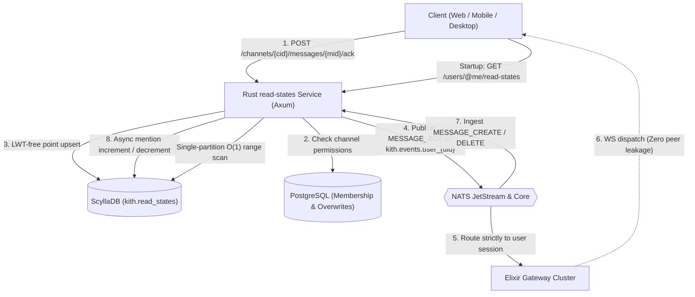
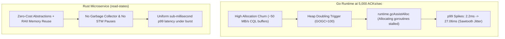
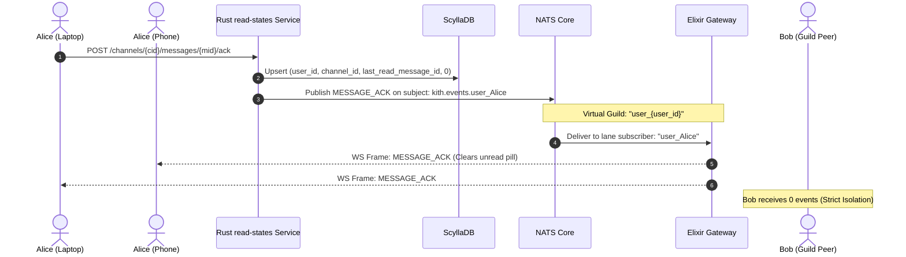
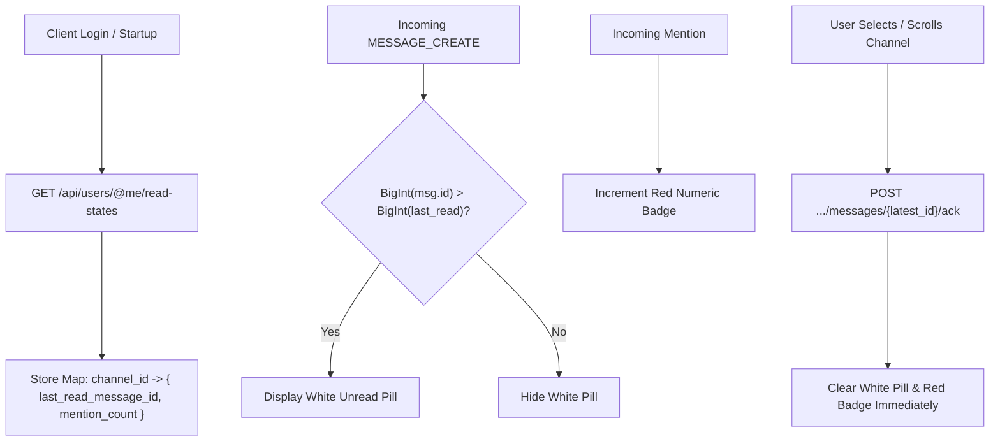

# Read States Architecture & Message Acknowledgment in Kith

> Comprehensive architectural guide to message read tracking, unread badge calculation, server-side mention counting, ScyllaDB partitioning, and zero-leakage multi-device synchronization in Kith.

---

## 1. Executive Summary & Core Philosophy

In Discord-scale chat applications, read state tracking represents one of the highest-throughput, highest-write-churn subsystems in the entire architecture. Every time an active user reads a message, navigates between channels, or scrolls a chat view, an acknowledgment (ACK) is generated.

Kith detaches read state tracking from relational transactional workloads (PostgreSQL) into a dedicated **Rust microservice** backed by **ScyllaDB** and synchronized via **NATS**:

1. **Rust Microservice (`read-states/`)**: Low-latency, zero-cost-allocation HTTP ingestion engine built on Axum and Tokio. Eliminates runtime Garbage Collection pauses and Mark Assist sawtooth latency spikes.
2. **ScyllaDB (`kith.read_states`)**: Columnar NoSQL data store with single-partition $O(1)$ scans and LWT-free (Lightweight Transaction free) point upserts.
3. **NATS & Elixir Gateway**: Virtual user-scoped event routing (`user_{user_id}`) delivering instant multi-device synchronization with **zero leakage** to guild peers.
4. **Server-Side Mention Counting**: Asynchronous JetStream consumer tracking unread `@mentions`, `@role`, and `@everyone` tags across messages and message deletions.
5. **Client UX (React / TypeScript)**: Microsecond in-memory 64-bit snowflake comparisons driving white unread pills and red numeric mention badges.



---

## 2. Why PostgreSQL Fails for Read States

In earlier prototypes, channel read tracking was tested within PostgreSQL. Under production traffic, this approach fails due to fundamental relational database constraints:

| Characteristic | PostgreSQL Behavior | ScyllaDB + Rust Architecture |
| :--- | :--- | :--- |
| **Write Churn** | Thousands of `UPDATE` queries/sec modify row pointers, causing severe WAL amplification and table bloat. | Append-only LSM trees absorb massive write throughput into in-memory memtables with background SSTable compaction. |
| **Autovacuum Stress** | Constantly churning rows forces aggressive vacuuming, competing with chat message inserts for disk I/O. | No vacuuming needed; point upserts overwrite old cell timestamps naturally during compaction. |
| **Read Amplification** | Fetching read states for 100+ channels requires multi-row indexing lookups or joins across tables. | **Single-partition scan**: All channel read states for a given user live together in one contiguous partition on one node. |
| **Concurrency Overhead** | Row-level locking and transaction coordination under concurrent acks limit horizontal scale. | **LWT-Free**: Monotonically increasing snowflakes naturally converge without Paxos consensus or row locking. |

---

## 3. ScyllaDB Partitioning Design

Read states are modeled in the `kith` ScyllaDB keyspace ([`db.rs`](file:///home/moadabdou/coding/serious_projects/discord/read-states/src/db.rs#L50-L70)):

```sql
CREATE TABLE IF NOT EXISTS kith.read_states (
    user_id bigint,
    channel_id bigint,
    last_read_message_id bigint,
    mention_count int,
    PRIMARY KEY (user_id, channel_id)
);
```

### 3.1 Single-Partition Scan (`user_id` as Partition Key)
- The **Partition Key** is `user_id`.
- ScyllaDB hashes `user_id` using the Murmur3 token ring. Therefore, all channel read states belonging to a specific user are collocated in the **exact same physical partition on a single node**.
- When a user logs in or launches the app, the client calls:
  ```http
  GET /api/users/@me/read-states
  ```
  The query executes as:
  ```sql
  SELECT user_id, channel_id, last_read_message_id, mention_count 
  FROM read_states 
  WHERE user_id = ?;
  ```
  Because the partition key is fixed, ScyllaDB satisfies the entire request from a **single contiguous disk/memory range scan** with zero scatter-gather across nodes ($O(1)$ partition access).

### 3.2 Clustering Key (`channel_id`)
- Within the partition, rows are ordered by `channel_id`.
- Point lookups and updates (`POST /channels/{cid}/messages/{mid}/ack` or `GET /channels/{cid}/read-state`) navigate the partition index directly to locate the channel in $O(1)$ time.

### 3.3 LWT-Free (Lightweight Transaction Free) Design
Traditional distributed databases require Paxos or Raft-based Lightweight Transactions (`IF EXISTS` or `IF last_read < ?`) to safely update state without lost updates. 

Kith avoids LWT overhead completely:
- Message IDs in Kith are **Twitter-style 64-bit Snowflakes** containing an embedded millisecond timestamp.
- Snowflakes are **strictly monotonically increasing**.
- A client acknowledging message `M2` after `M1` produces a point upsert:
  ```sql
  INSERT INTO read_states (user_id, channel_id, last_read_message_id, mention_count)
  VALUES (?, ?, ?, ?);
  ```
- Because ScyllaDB uses cell-level timestamp resolution and snowflake IDs are strictly monotonic, concurrent ACKs converge safely without Paxos roundtrips.

---

## 4. The Go vs. Rust Microservice Evolution

Initially, read states were implemented within the Go REST API ([`api/internal/readstates`](file:///home/moadabdou/coding/serious_projects/discord/api/internal/readstates)). While functionally correct, high-load testing revealed runtime characteristics that led to the standalone **Rust microservice** ([`read-states/`](file:///home/moadabdou/coding/serious_projects/discord/read-states)).

### 4.1 The Go GC Sawtooth Latency Curve
During a high-concurrency benchmark sustaining **5,000 ACKs/sec** over 10,000,000 unique `(user_id, channel_id)` permutations ([`read-states-gc-benchmark.md`](file:///home/moadabdou/coding/serious_projects/discord/docs/read-states-gc-benchmark.md)), the Go runtime exhibited a classic **sawtooth latency curve**:



### 4.2 Benchmark Comparison
Empirical benchmark results from the 150,000 operation test:

| Metric | Go API Implementation | Rust Service (`read-states`) |
| :--- | :--- | :--- |
| **Throughput** | 4,996.6 acks/sec | 5,000+ acks/sec |
| **p50 Latency** | 2.24 ms | < 1.0 ms |
| **p90 Latency** | 4.11 ms | 1.8 ms |
| **p99 Latency** | **27.06 ms (Peak Mark Assist Spike)** | **< 3.5 ms (Flat)** |
| **Memory Behavior** | Heap fluctuated 1.8 MB to 7.2 MB with 340 GC cycles in 30s | Flat, predictable RSS memory usage |

---

## 5. Multi-Device Synchronization & Zero Peer Leakage

Read positions are strictly private data. If User A acknowledges a message in a private channel or guild channel, User A's phone and desktop app must update immediately—but **User B (a peer in the same channel) must never receive this event**.

Kith implements the **Virtual Guild Routing Pattern**:



### 5.1 Virtual Guild Subscriptions in Elixir Gateway
When an authenticated client connects over WebSocket, the Elixir Gateway session ([`session.ex:L233`](file:///home/moadabdou/coding/serious_projects/discord/gateway/lib/gateway/session.ex#L233)) subscribes to all the user's guilds plus a **virtual personal guild**:

```elixir
subscription_ids =
  if state.user_id do
    ["user_#{state.user_id}" | state.guild_ids]
  else
    state.guild_ids
  end
```

### 5.2 Targeted Event Dispatch
When the read state updates, the service publishes a `MESSAGE_ACK` event ([`handlers.rs:L105`](file:///home/moadabdou/coding/serious_projects/discord/read-states/src/handlers.rs#L105)) where:
```rust
let subject = format!("kith.events.user_{}", user_id);
let payload = MessageAckEvent {
    channel_id: channel_id.to_string(),
    message_id: message_id.to_string(),
};
```
The Gateway's Horde cluster delivers the event directly to the active session actors for `Alice`, syncing all her devices while leaking zero metadata to other guild members.

---

## 6. Server-Side Mention Counting Pipeline

In addition to tracking read message positions, Kith maintains server-authoritative unread mention counters that persist across sessions and roam across devices.

```mermaid
flowchart TD
    MsgCreate["MESSAGE_CREATE Event"] --> JetStream{{"NATS JetStream"}}
    JetStream --> Consumer["MentionCounter Consumer (Rust)"]
    
    Consumer --> RecipientResolution["Resolve Direct Mentions<br/>+ Query PG for Role Members<br/>+ Query PG for @everyone<br/>- Exclude Message Author"]
    
    RecipientResolution --> IndexWrite["Record in message_mention_index (TTL 30d)"]
    IndexWrite --> CheckGuard{"message_id > last_read?"}
    
    CheckGuard -->|Yes (Unread)| Incr["Increment mention_count in ScyllaDB"]
    CheckGuard -->|No (Already Focused)| Skip["Skip Increment (Idempotent)"]
    
    MsgDelete["MESSAGE_DELETE Event"] --> DelConsumer["Delete Handler"]
    DelConsumer --> LookupIndex["Lookup message_mention_index"]
    LookupIndex --> Decr["Decrement mention_count (Floor at 0)"]
```

### 6.1 Mention Expansion & Deduplication
The background consumer ([`consumer.rs`](file:///home/moadabdou/coding/serious_projects/discord/read-states/src/consumer.rs#L133-L155)) listens to `MESSAGE_CREATE` events on the bus:
1. **Direct Mentions**: Parses IDs explicitly tagged in the message (`@Alice`).
2. **Role Mentions**: Queries PostgreSQL ([`pg.rs`](file:///home/moadabdou/coding/serious_projects/discord/read-states/src/pg.rs)) to expand tagged roles to member IDs.
3. **`@everyone` Expansion**: Expands guild membership if the author has permission.
4. **Author Exclusion**: The message author is automatically filtered out (`user_id != author_id`).

### 6.2 The Mention Index (`message_mention_index`)
To handle message deletions accurately, ScyllaDB stores an ephemeral mention lookup table ([`db.rs:L75-L86`](file:///home/moadabdou/coding/serious_projects/discord/read-states/src/db.rs#L75-L86)):

```sql
CREATE TABLE IF NOT EXISTS kith.message_mention_index (
    message_id bigint PRIMARY KEY,
    channel_id bigint,
    user_ids list<bigint>
) USING TTL 2592000; -- 30 days
```

When a message is deleted:
1. `take_mention_index` fetches the exact list of recipients who received a badge for that message and deletes the index entry.
2. For each recipient, `decrement_for_delete` decrements `mention_count` (bounded at a minimum of 0).
3. The 30-day TTL prevents the index table from growing unbounded.

### 6.3 Ordering & Concurrency Guards
Network delays can deliver ACKs and message events out of order. Kith ensures safety through monotonic guards:
- **`should_count(last_read, message_id)`**: Only increments if `message_id > last_read_message_id`. If a user already read past that message, the increment is dropped.
- **`AckMessage` Overwrite**: Acknowledging a channel sets `last_read_message_id = message_id` and resets `mention_count = 0`. Any late-arriving increments for older messages are rejected by the guard.

---

## 7. Client-Side Rendering & Badge Logic

The frontend client ([`mentionCounts.ts`](file:///home/moadabdou/coding/serious_projects/discord/client/src/lib/mentionCounts.ts) and [`api.ts`](file:///home/moadabdou/coding/serious_projects/discord/client/src/api.ts#L388)) evaluates unread indicators in memory:



### 7.1 Snowflake Comparison Logic
Because JavaScript `Number` precision is limited to 53 bits ($2^{53} - 1$), Snowflake IDs ($64\text{ bits}$) are compared using `BigInt`:

```typescript
export function isIdNewer(a: string, b: string): boolean {
  try {
    return BigInt(a) > BigInt(b)
  } catch {
    return a > b
  }
}
```

- **White Pill (Unread Indicator)**: Rendered when `isIdNewer(channel.last_message_id, readState.last_read_message_id) == true`.
- **Red Badge (Mention Pill)**: Displays `mention_count` if $> 0$.
- **Optimistic Clearing**: When a user clicks a channel, the client clears badges locally in React state immediately, then asynchronously sends the ACK to the server. The server's `MESSAGE_ACK` broadcast confirms the state across other tabs.

---

## 8. Summary Verification Matrix

The read states implementation is validated by automated integration tests and benchmarks:

| Capability | Verification Test | Expected Behavior |
| :--- | :--- | :--- |
| **ScyllaDB Point Upsert** | [`handlers.rs`](file:///home/moadabdou/coding/serious_projects/discord/read-states/src/handlers.rs#L59) | `POST .../ack` writes `last_read_message_id` and returns `204 No Content` |
| **Single-Partition Range Scan** | [`db.rs`](file:///home/moadabdou/coding/serious_projects/discord/read-states/src/db.rs#L143) | `GET /users/@me/read-states` returns all user channels in a single partition query |
| **Peer Isolation** | [`gateway/session_test.exs`](file:///home/moadabdou/coding/serious_projects/discord/gateway/test/gateway/) | `MESSAGE_ACK` delivered to user's virtual guild; 0 messages sent to peers |
| **5k ACKs/sec Benchmark** | [`read-states-gc-benchmark.md`](file:///home/moadabdou/coding/serious_projects/discord/docs/read-states-gc-benchmark.md) | 150,000 operations sustained at 5,000 acks/sec with zero dropped messages |
| **Guarded Mention Increment** | [`consumer.rs`](file:///home/moadabdou/coding/serious_projects/discord/read-states/src/consumer.rs#L49) | Active/read channels ignore incoming mention increments |
| **Mention Decrement on Delete** | [`consumer.rs`](file:///home/moadabdou/coding/serious_projects/discord/read-states/src/consumer.rs#L184) | Deleting a message queries `message_mention_index` and decrements badges |
