# Kith SFU Server — The Comprehensive Guide

> **What this is:** a complete, code-grounded explanation of the Kith Selective
> Forwarding Unit (SFU) — the Go + Pion WebRTC media server in `sfu/` that
> carries every voice call, video tile, and screen share.
>
> **Scope:** everything below is traced to real files. Each section cites the
> source (`file:line`). Mermaid diagrams render on GitHub.
>
> **Audience:** you already know what WebRTC, RTP, and SDP are at a high level
> (see `plan/07-voice-video.md` §0). This guide explains what *this* SFU does
> with them, and why.

---

## Table of Contents

1. [What an SFU Is (and Isn't)](#1-what-an-sfu-is-and-isnt)
2. [System Position — Where the SFU Lives](#2-system-position--where-the-sfu-lives)
3. [Process Layout — The Code Map](#3-process-layout--the-code-map)
4. [Boot Sequence — `cmd/sfu/main.go`](#4-boot-sequence--cmdsfumain.go)
5. [Signaling Protocol — The WebSocket Contract](#5-signaling-protocol--the-websocket-contract)
6. [Peer — One `RTCPeerConnection` per User](#6-peer--one-rtcpeerconnection-per-user)
7. [Room Actor — One Goroutine per Voice Channel](#7-room-actor--one-goroutine-per-voice-channel)
8. [Router — The Forwarding Core](#8-router--the-forwarding-core)
9. [Publisher Uplink — Ingress](#9-publisher-uplink--ingress)
10. [Subscriber Downlink — Egress](#10-subscriber-downlink--egress)
11. [Audio Path End-to-End](#11-audio-path-end-to-end)
12. [Video Path: Simulcast Ingestion](#12-video-path-simulcast-ingestion)
13. [Video Path: Keyframe Cache + PLI Limiter (Instant Render)](#13-video-path-keyframe-cache--pli-limiter-instant-render)
14. [Video Path: Adaptive Layer Switching](#14-video-path-adaptive-layer-switching)
15. [Loss Repair: NACK Translation + RTX](#15-loss-repair-nack-translation--rtx)
16. [Renegotiation Choreography](#16-renegotiation-choreography)
17. [Negotiate-Once Contract + `videoKind`](#17-negotiate-once-contract--videokind)
18. [Graceful Leave vs Abrupt Disconnect](#18-graceful-leave-vs-abrupt-disconnect)
19. [Event Bus — `voice.peer_joined/left`](#19-event-bus--voicepeer_joinedleft)
20. [Observability — Metrics Reference](#20-observability--metrics-reference)
21. [Deployment — Ports, Env, Docker](#21-deployment--ports-env-docker)
22. [Failure Drills — What Was Proven](#22-failure-drills--what-was-proven)
23. [Limits & Honest Non-Goals](#23-limits--honest-non-goals)
24. [FAQ](#24-faq)
25. [File Index](#25-file-index)

---

## 1. What an SFU Is (and Isn't)

A **Selective Forwarding Unit** is a media router. It receives each
participant's encrypted RTP streams and **forwards** (never mixes, never
transcodes) selected packets to each subscriber.

```
MESH (Phase 5a — the wall)              SFU (Phase 5c — this server)
==========================              ============================

  A ◄───► B                               A ──┐
  │╲     ╱│                                   ▼
  │ ╲   ╱ │                              ┌─────────┐
  │  ╲ ╱  │                              │   SFU   │
  │  ╱ ╲  │                              └─────────┘
  │ ╱   ╲ │                                   ▲
  C ◄───► D                               B ──┘   C ──┘  ...

N users → N-1 PeerConnections each        N users → 1 PeerConnection each
Uploader sends stream × (N-1)             Uploader sends stream × 1
```

| Topology | Uplink cost (per sender) | Who pays CPU |
|---|---|---|
| Mesh | stream × (N−1) | every client |
| MCU (mixes) | stream × 1, receives 1 mixed | server decodes+mixes+re-encodes |
| **SFU (this)** | **stream × 1, receives N−1** | **server forwards packets only** |

The SFU's mantra (`plan/07-voice-video.md` §3): *"forwards, never mixes,
never transcodes — say that sentence until it's reflexive."*

**Why forwarding is harder than it sounds.** Every hard problem lives inside
the fan-out loop — per-subscriber sequence rewriting, backpressure without
blocking, keyframes (a P-frame with a hole is undecodable), RTCP feedback
routing, and per-viewer layer selection. Each gets its own section below.

---

## 2. System Position — Where the SFU Lives

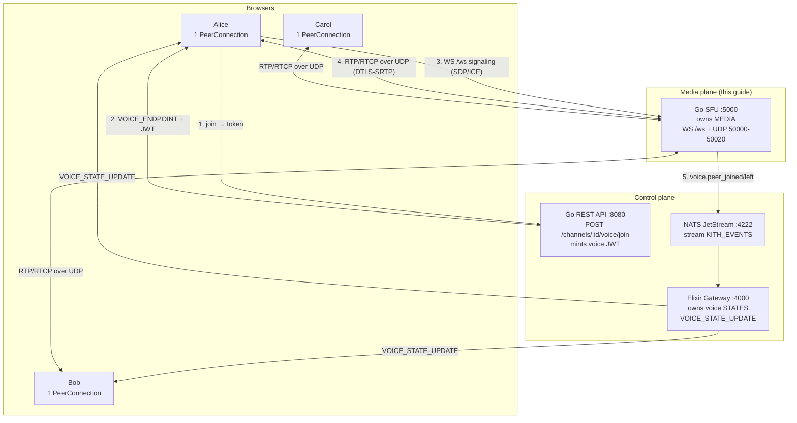

**Two ownerships, one event stream** (`plan/07-voice-video.md` §3):

| Owner | Source of truth for | Survives the other's outage? |
|---|---|---|
| Gateway | *who is where* (voice states, mute flags) | — |
| **SFU** | ***media* (who hears/sees whom)** | **yes — media keeps flowing if the gateway partitions** |

The media plane surviving a control-plane partition is a feature, not an
accident — it's how calls stay alive during gateway events.

---

## 3. Process Layout — The Code Map

```
sfu/
├── cmd/
│   ├── sfu/main.go              # bootstrap: env, NATS, Pion API, HTTP routes (§4)
│   └── voice_bench/             # chaos/benchmark driver (drills, §22)
│       ├── main.go              # audio drills: clap/impairment/failover/partition
│       └── video_drills.go      # video drills: pli_storm/layer_throttle/...
├── internal/
│   ├── signaling/server.go      # WS protocol: join/offer/answer/candidate/... (§5)
│   ├── peer/peer.go             # one RTCPeerConnection + ICE/SDP verbs (§6)
│   ├── room/
│   │   ├── manager.go           # channel_id → *Room registry (§7)
│   │   └── room.go              # Room actor: inbox + join/leave/disconnect (§7-8, §18)
│   ├── router/                  # per-room forwarding core (§8-17)
│   │   ├── router.go            # peers/publishers/subscribers maps, renegotiation
│   │   ├── publisher.go         # ingress: readingLoop fan-out, keyframe cache
│   │   ├── subscriber.go        # egress: queue, seq rewrite, RTCP loop
│   │   ├── layer_selector.go    # EWMA scorer + desiredLayer() policy
│   │   ├── keyframe.go          # VP8 keyframe detector (RFC 7741 §4.2)
│   │   ├── seq_translator.go    # downlink↔uplink seq map (NACK + RTX repair)
│   │   └── pli_limiter.go       # 500 ms PLI/FIR coalescer per uplink
│   ├── auth/token.go            # voice JWT validation (§5)
│   ├── bus/bus.go               # NATS JetStream publisher (§19)
│   └── metrics/metrics.go       # Prometheus counters/gauges (§20)
├── Dockerfile                   # two-stage Go build, non-root, UDP range (§21)
└── go.mod                       # module github.com/moadabdou/Kith/sfu (Pion v4)
```

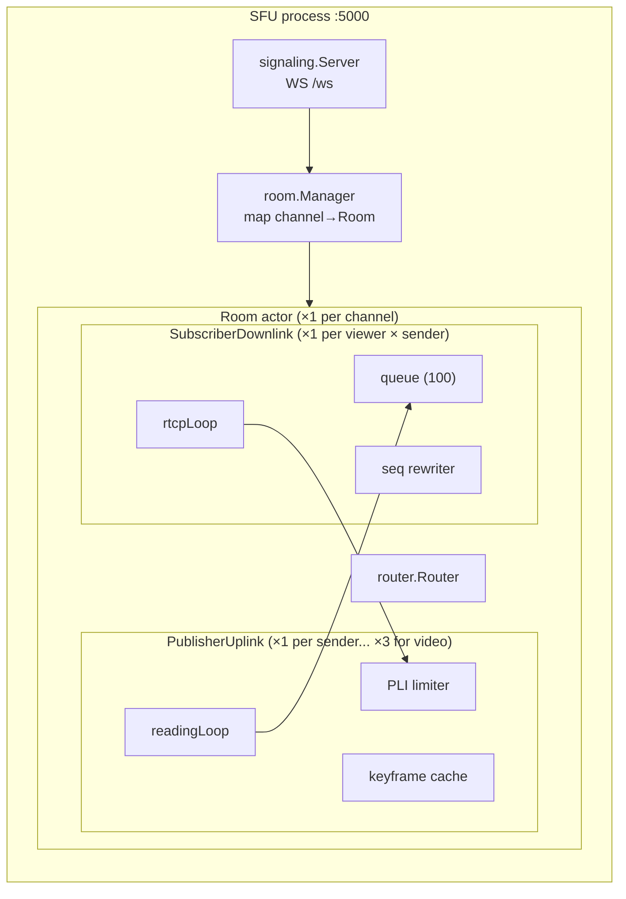

---

## 4. Boot Sequence — `cmd/sfu/main.go`

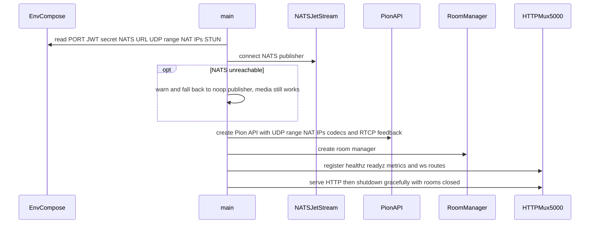

Key file: `sfu/cmd/sfu/main.go:89-174`.

Notable decisions:

- **NATS is optional at boot.** If JetStream is down the SFU still forwards
  media; only `voice.peer_*` presence events stop (`main.go:92-103`).
- **One shared `webrtc.API`** for all peers (`peer.CreateAPI`), with the UDP
  port range clamped (`50000-50020` default) so Docker/K8s only opens 21 ports.
- **Video RTCP feedback is registered up front** — `nack`, `nack pli`,
  `goog-remb`, `ccm fir` for video codecs (`peer.go:325-334`). Without this,
  browsers won't send NACK/PLI and every repair path below is dead.

---

## 5. Signaling Protocol — The WebSocket Contract

WebRTC deliberately does **not** define signaling — it's yours
(`plan/07-voice-video.md` §0). This SFU's signaling is a JSON WebSocket at
`WS /ws`, implemented in `sfu/internal/signaling/server.go`.

### 5.1 Message catalog

| `type` | Direction | Payload | Effect |
|---|---|---|---|
| `join` | C→S | `token` (voice JWT), `channel_id`, `guild_id`, `listen_only?` | validate JWT → create `Peer` → `Room.Join` → reply `joined` + `peers[]` |
| `joined` | S→C | `channel_id`, `peers[]` | join ack; client now sends offer |
| `offer` | C→S | `sdp` | `HandleOffer` → reply `answer`; attach downlinks to existing publishers |
| `answer` | C→S | `sdp` | completes **server-initiated** renegotiation (new downlinks) |
| `candidate` | C↔S | `candidate` | trickle ICE both ways (server streams its candidates via a goroutine) |
| `offer` | S→C | `sdp` | **renegotiation**: "I added downlink tracks, please accept" (§16) |
| `speaking` | C→S | `speaking` bool | broadcast to room (who's-talking UI) |
| `video` / `screen` | C→S | bool | **kind declaration** → `SetVideoKind` → broadcast (§17) |
| `peer_joined` / `peer_left` | S→C | `user_id` | roster deltas for the UI |
| `leave` | C→S | — | explicit leave → immediate eviction |
| `error` | S→C | `message` | `unauthorized`, `already joined`, `must join before offer`, … |

### 5.2 Join flow (the happy path)

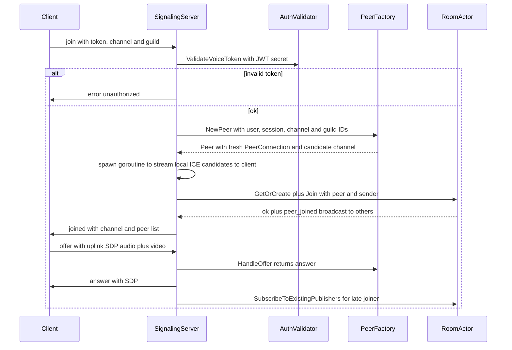

Source: `sfu/internal/signaling/server.go:119-222`.

### 5.3 Auth — the voice JWT

`sfu/internal/auth/token.go:25-63`:

- HS256 JWT minted by the REST API, carrying `user_id` (or std `sub`),
  `guild_id`, `channel_id`.
- Empty/expired/bad-signature → `unauthorized`, connection closed.
- Dev escape hatch: `JWT_SECRET=none` accepts any non-empty token as
  `dev-user` (local testing only).

---

## 6. Peer — One `RTCPeerConnection` per User

`sfu/internal/peer/peer.go` wraps a Pion `PeerConnection` with the verbs the
rest of the system needs:

```
┌──────────────────────────────── Peer ────────────────────────────────┐
│  PC *webrtc.PeerConnection      Candidates chan (cap 64, trickle out)│
│  HandleOffer(sdp)→answer   HandleAnswer(sdp)   CreateOffer()→offer    │
│  AddTrack(local)  RemoveTrack(sender)  AddCandidate(c)  WriteRTCP(p)  │
│  callbacks: onTrack │ onClose │ onSignalingStable                     │
│  state hooks: ICE fail → Close │ PC failed/closed → Close             │
└──────────────────────────────────────────────────────────────────────┘
```

Connection lifecycle, as wired in `NewPeer` (`peer.go:96-171`):

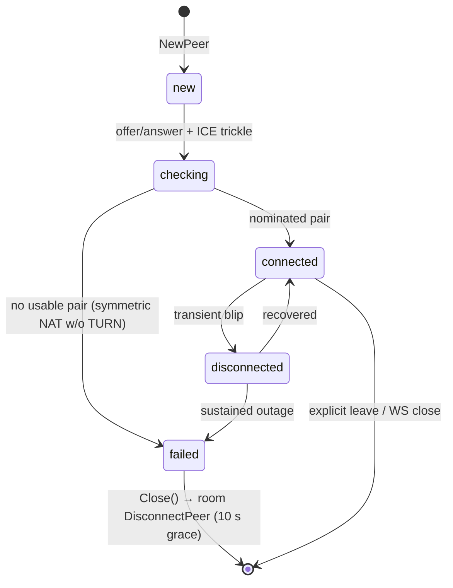

ICE failure auto-closes the peer (`peer.go:134-137`), which cascades into the
room's disconnect grace path (§18) — no orphaned PeerConnections.

---

## 7. Room Actor — One Goroutine per Voice Channel

`sfu/internal/room/manager.go` keeps `map[channelID]*Room`. `GetOrCreate`
spawns a `Room` on first join; the room self-removes when the last peer
leaves (`finalizePeerEviction` → `onEmpty` → `Manager.Remove`).

Each `Room` (`room.go:38-50`) is an **actor**: a single goroutine owns all
mutable state, driven by a buffered inbox (`cap 64`). No locks on the room
maps — serialization *is* the concurrency control:

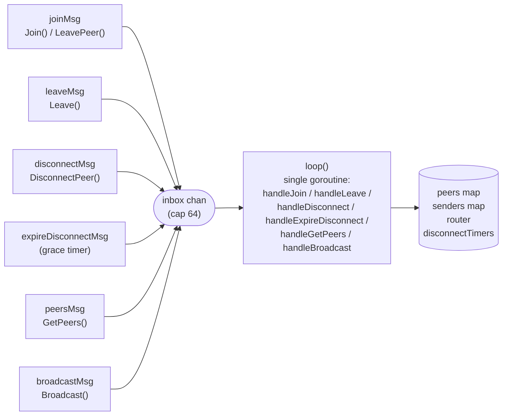

Callers use request/reply channels (`replyTo chan error`) so `Join`/`Leave`
are synchronous from the outside while remaining race-free inside
(`room.go:446-545`).

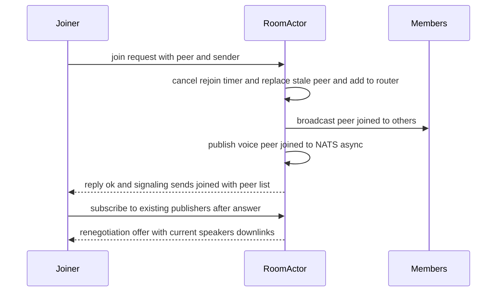

---

## 8. Router — The Forwarding Core

`sfu/internal/router/router.go` is the heart of the SFU: three maps, one
mutex, and the invariant **"every uplink fans out to every other peer."**

```
Router (per room)
├── peers:       userID → {peer, renegotiate cb, pending flag}
├── publishers:  trackKey → *PublisherUplink        (ingress, §9)
└── subscribers: subID → { uplinkKey → {downlink, sender} }  (egress, §10)

trackKey()  (router.go:323-339)
  audio → pubID:audio:<trackID>
  video → pubID:video:<rid>        (f / h / q; "" → f legacy)
```

**Fan-out on publish** (`AddPublisher`, `router.go:523-565`):

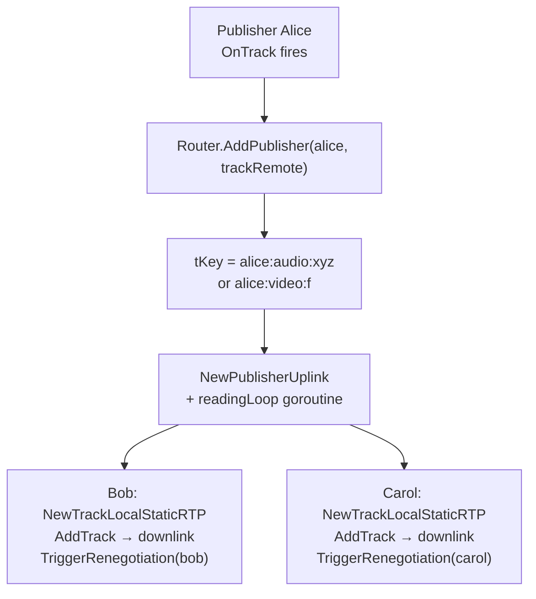

**Teardown on leave** mirrors it: `RemovePeer` tears down the leaver's
uplinks *and* every downlink others held from them, then renegotiates the
affected subscribers (`router.go:494-517`). Uplink death without explicit
leave (track EOF) self-evicts via the `onDeath` callback (`onUplinkDeath`,
`router.go:842-873`) — corpses are never fanned out.

---

## 9. Publisher Uplink — Ingress

`sfu/internal/router/publisher.go`. One `PublisherUplink` per **track**, so a
simulcast camera owner has *three* (`alice:video:f/h/q`), each with its own
SSRC, keyframe cache, and PLI limiter.

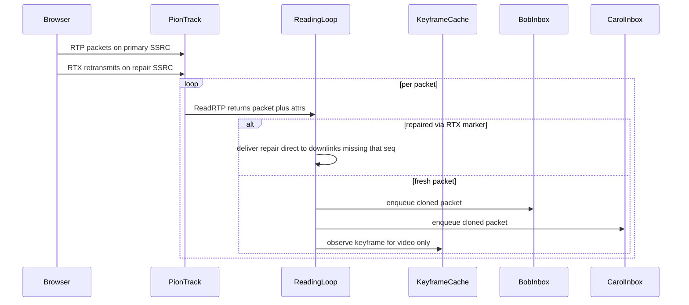

Details:

- **Clone per subscriber** (`publisher.go:259-264`): each downlink rewrites
  sequence numbers independently (§10), so sharing the pointer would corrupt
  every other viewer.
- **RTX tracks never become uplinks.** Pion surfaces retransmission streams
  as separate `TrackRemote`s with the RTX MIME type; `Room.handleJoin`
  refuses to register them (`room.go:212-218`) — registering one would map its
  RID-less key onto `LayerFull` and clobber the real camera uplink.
- **Stable downlink IDs** (`publisher.go:174-196`): viewers address tracks as
  `kith-track-<uid>-video` / `-screen` / `kith-stream-<uid>`, derived from the
  user ID — never the browser's random uplink IDs. Tiles survive switches.

---

## 10. Subscriber Downlink — Egress

`sfu/internal/router/subscriber.go`. One `SubscriberDownlink` per
(viewer × sender [× layer]) pair. Two goroutines, one bounded queue:

```
PublisherUplink ──Enqueue(pkt.Clone())──► ┌─ inbox (cap 100, non-blocking)
                                           │     full → DROP + PacketsDropped.Inc
                                           ▼
                                    forwardingLoop:
                                      seq = atomic++            (per-viewer space)
                                      seqTr.note(new, uplink)   (for NACK/RTX)
                                      TrackLocal.WriteRTP(pkt)
                                           │
                                           ▼ viewer jitter buffer (client-side)

                                    rtcpLoop (reads viewer's RTCP):
                                      RR   → score.observeRR + FractionLost gauge
                                      NACK → translate seqs → forward to publisher
                                      PLI  → uplink PLI limiter (coalesced)
                                      FIR  → same limiter
```

**Why per-viewer sequence rewriting?** Each downlink starts at seq 1 and
counts independently; viewers join mid-stream and drops differ per link. A
shared sequence space would make every viewer's jitter buffer see phantom gaps
and duplicates. The `seqTranslator` (§15) remembers the mapping so feedback
still routes correctly.

**Backpressure policy:** the inbox send is `select/default` — a slow viewer
drops, never blocks the publisher's `readingLoop` (`subscriber.go:77-92`).
One stalled viewer cannot stall the room.

---

## 11. Audio Path End-to-End

Audio is the simple, always-on path — no layers, no keyframes, no switching.

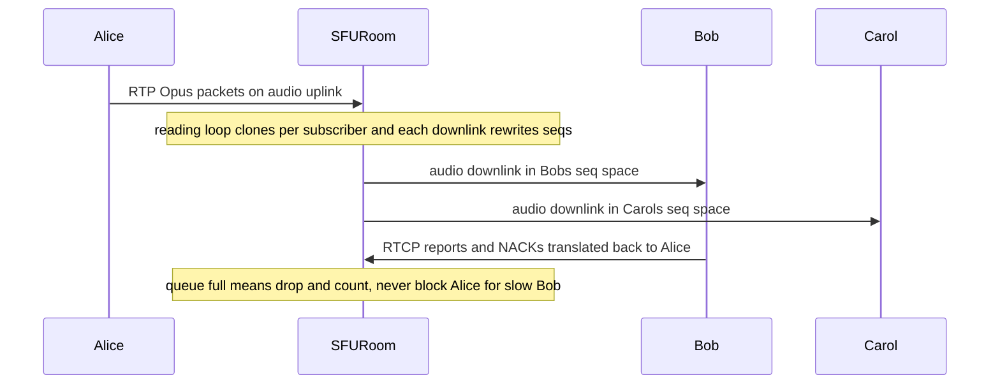

Audio quality knobs live client-side (Opus, DTX, RED/FEC — see
`plan/07-voice-video.md` §1); the SFU forwards Opus bytes untouched.

---

## 12. Video Path: Simulcast Ingestion

The publisher sends **three encodings of the same camera frame**
(`client/src/lib/sfu-client.ts:199-203`):

| RID | Label | Resolution | Max bitrate |
|---|---|---|---|
| `f` | full | 720p | 2.5 Mbps |
| `h` | half | 360p (÷2) | 500 kbps |
| `q` | quarter | 180p (÷4) | 150 kbps |

Screen share is `f`-only + `maintain-resolution` + `contentHint: detail`
(single layer — screens are bursty content, and per-layer switching would
smear text).

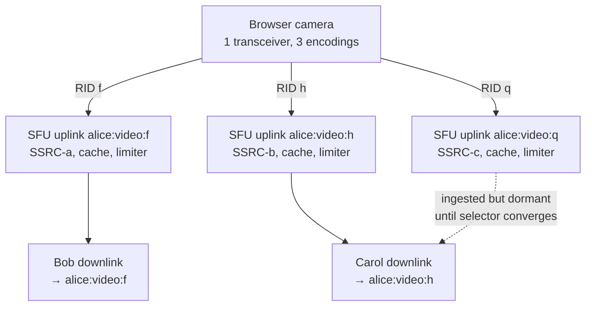

Ingestion detail (`router.go:trackKey`, `AddPublisher`):

- Video uplink keys are `pubID:video:<RID>`; empty RID (legacy/non-simulcast)
  maps to `f`.
- Only `f` fans out immediately; `h`/`q` stay **ingested-but-dormant** until
  the layer selector moves a viewer onto them — and only when the publisher's
  declared kind is camera/screen (`videoKind ≠ none`).

---

## 13. Video Path: Keyframe Cache + PLI Limiter (Instant Render)

**The problem:** video decoders need a keyframe (full picture) before they can
render. A viewer joining mid-stream waits for the publisher's next natural
keyframe — punishing on static screen content that rarely keyframes.

**The fix, in two parts** (issue #81):

### 13.1 Per-uplink keyframe cache

`PublisherUplink.observeKeyframe` (`publisher.go:336-377`) watches the ingest
stream with a VP8 detector (`keyframe.go`: S-bit partition 0 + frame-tag P-bit
0, per RFC 7741 §4.2). The latest complete keyframe (≤ 256 packets) is kept;
subscriptions replay it into the fresh downlink **before live packets**
(`router.go:673-681`, `switchLayer` prime at `router.go:267-271`) so the
joiner decodes immediately. Stale cache (> 2 s initial / > 1 s on switches)
falls back to PLI-immediate.

### 13.2 PLI limiter (storm protection)

The naive fallback — every joiner sends PLI, publisher encodes a keyframe per
request — collapses under join/leave storms (20 viewers × PLI = 20 keyframes).
`pli_limiter.go` coalesces per uplink to **≤ 1 forward per 500 ms window**:

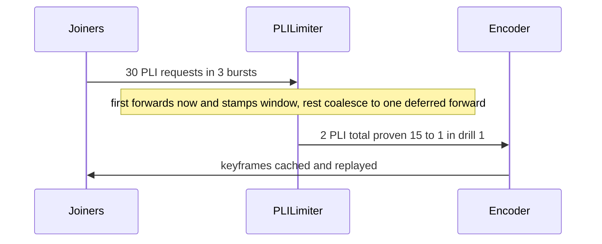

Measured: 30 received → 2 forwarded (**15:1**, `postmortems/phase-6.md` drill 1).

---

## 14. Video Path: Adaptive Layer Switching

Each camera viewer's downlink converges independently to the layer their link
can drink. The SFU **reacts** (no TWCC/REMB estimator — bandwidth *control*
stays in the publisher's encoder; the SFU just stops sending undrinkable bits).

### 14.1 Signal → score → decision

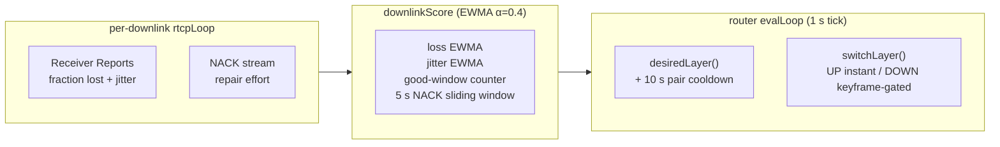

Policy (`layer_selector.go:22-50`, `router.go:61-74`):

| Direction | Trigger | Speed |
|---|---|---|
| **DOWN** one rank | loss EWMA ≥ 5%, **or** jitter ≥ 50 ms + any loss, **or** NACK ≥ 20/s | fast: 1 bad window (~1–2 s) |
| **UP** one rank | loss ≤ 1% for **5 consecutive windows** *and* NACK < 20/s | slow: ~5 s + 10 s cooldown, one rank per tick |
| Floor | `q` (180p) — never audio-only | — |
| Excluded | screen, audio, kind-none | never switch |

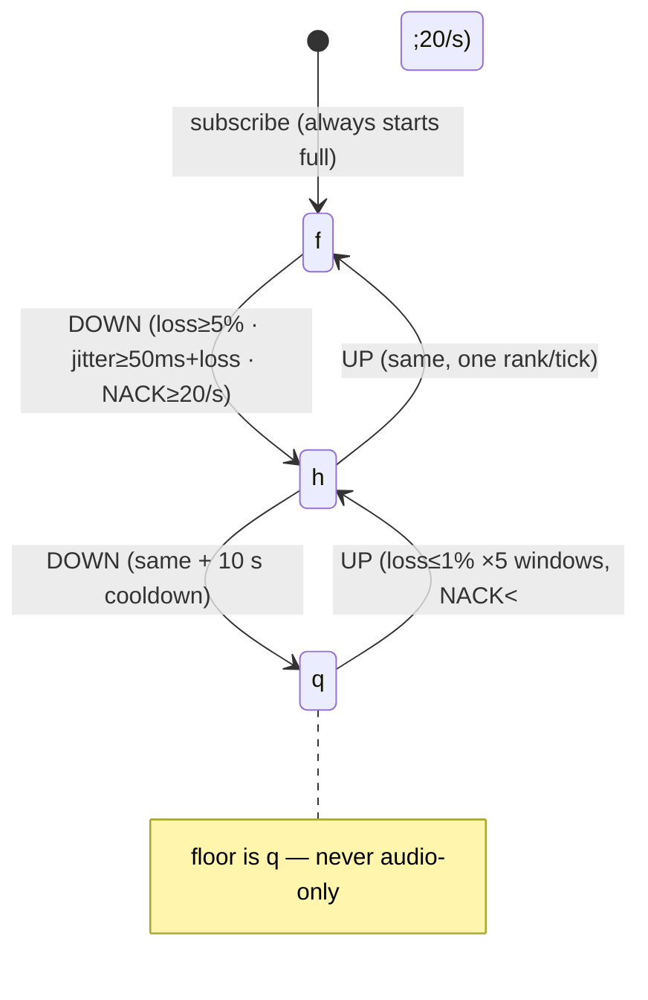

### 14.2 Why NACK rate is a signal (the repair-masking fix)

Heavy retransmission *masks* damage from loss %: a viewer can report clean
loss while drowning in repairs. The 5 s NACK sliding window (cap 512
timestamps) treats **repair effort as congestion**: ≥ 20 NACK/s forces DOWN
exactly like high loss and blocks UP until the storm passes.

### 14.3 Switch mechanics (`switchLayer`, `router.go:187-301`)

- **UP:** instant swap + cached-keyframe replay + coalesced PLI. Stepping up
  is always safe (decoder gets a fresh anchor).
- **DOWN:** hold until the target layer has a keyframe ≤ 1 s fresh; drop
  intermediates (decoding P-frames across a hole corrupts); PLI + retry next
  tick if none. The downlink keeps stable IDs (`kith-track-<uid>-video`) so
  client tiles never orphan.
- Proven: clean / ~10% / ~35% loss profiles stabilize on **f=1, h=1, q=1**
  with 3 DOWN / 0 UP, no flapping (`postmortems/phase-6.md` drill 2).

---

## 15. Loss Repair: NACK Translation + RTX

Two cooperating mechanisms hide packet loss without keyframe waits (~50 ms
repair vs seconds of frozen video).

### 15.1 Viewer NACK → publisher (seq translation)

Viewers NACK in **downlink** seq space (their private numbering, §10); the
publisher only understands **uplink** space. `seqTranslator`
(`seq_translator.go`) is a lock-free 2048-entry ring recording both directions
at forward time (`note(down, up)`); `translateNackPairs` converts and
regroups the bitmask pairs, dropping untranslatable entries (aged out / never
forwarded — retransmitting what was never sent is impossible).

### 15.2 Publisher RTX → viewer (gap-fill delivery)

Pion consumes the publisher's RTX retransmission stream in ingress and
surfaces repaired packets rewritten to the original (SSRC/seq/PT), flagged
only by interceptor attributes. `readingLoop` routes these to `deliverRepair`
(`publisher.go:311-331`), which looks up each subscriber's **reverse** mapping
(uplink→downlink) and writes the packet with the **exact missing downlink
seq** — a fresh seq would arrive as an out-of-window duplicate instead of
filling the hole. Direct `TrackLocal` writes bypass the inbox (retransmits are
late by nature and must not steal fresh seqs).

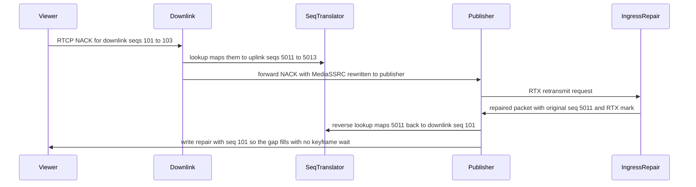

Metrics distinguish each stage: `rtx_repaired` (surfaced), `rtx_forwarded`
(gap-filled), `rtx_unmatched` (no mapping — aged out or never lost).

---

## 16. Renegotiation Choreography

Adding/removing downlink tracks changes the PeerConnection's SDP, requiring an
offer/answer round-trip — **initiated by the server**:

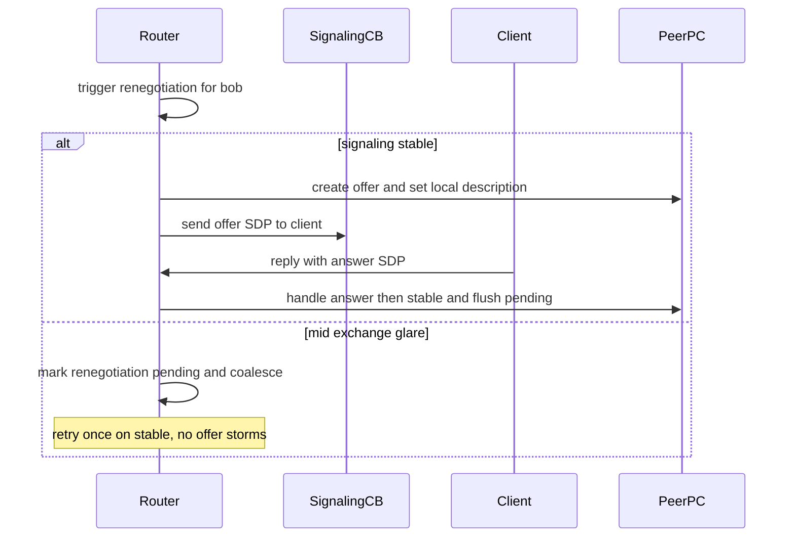

Source: `router.go:951-998`, `peer.go:242-276`, `signaling/server.go:224-241`.

The client must therefore handle **incoming offers at any time** (downlinks
appear when others join/publish/switch) — this is why `sfu-client.ts` keeps a
`pendingOffer` queue with bounded retries.

---

## 17. Negotiate-Once Contract + `videoKind`

Post-join, the client **never re-offers** to toggle camera/screen. Instead it
sends a lightweight signal (`video:true/false`, `screen:true/false`), and the
SFU converges forwarding from the last-writer-wins `videoKind` map
(`router.go:577-624`):

| Signal | Router action |
|---|---|
| `video:true` | label uplink `camera`; (re)build downlinks under `kith-track-<uid>-video` |
| `screen:true` | relabel `IsScreen`, tear down camera downlinks, build `-screen` ones (same RTP stream may be reused via `replaceTrack` — no `OnTrack` refire) |
| `video:false` / `screen:false` | tear down that kind's downlinks, **keep the uplink object** (stream may carry the next source) |
| unknown user | ignored — a pre-join signal can never fan out ghost state |

Why not SDP msids? Browser uplink track IDs are random per negotiation; the
out-of-band signal is the only stable label (`publisher.go:89-92` comment).

---

## 18. Graceful Leave vs Abrupt Disconnect

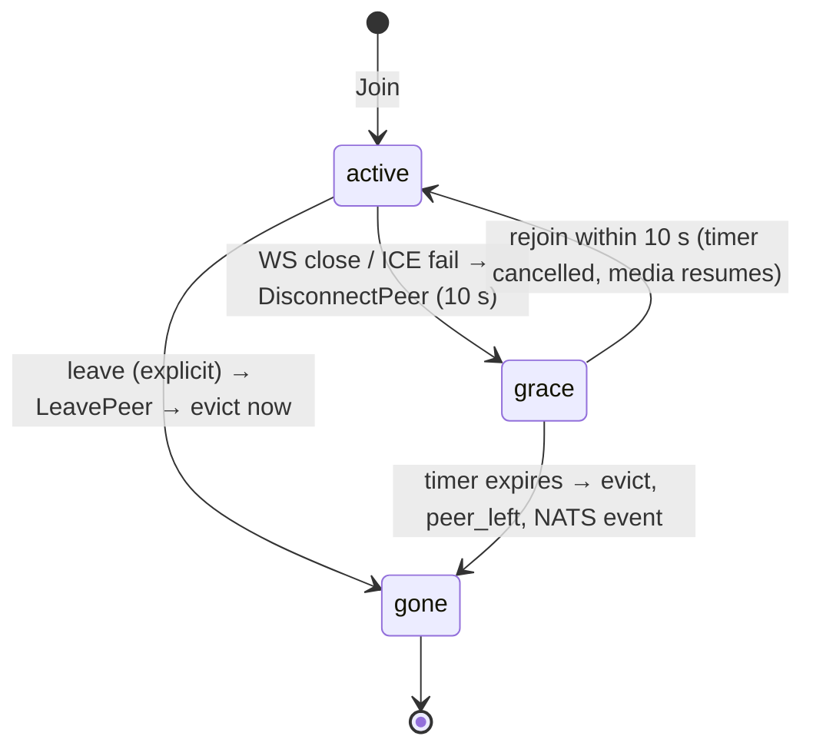

- **Explicit `leave`** (`signaling/server.go:302-304` → `room.LeavePeer`):
  immediate router teardown + `peer_left` broadcast + `voice.peer_left` event.
- **Abrupt close** (WS drop, ICE fail via `Peer.Close → onClose`,
  `room.go:223-227`): media torn down at once (dead tracks stop instantly and
  viewers get explicit `video:false`/`screen:false` so no ghost tiles), but
  the roster slot survives **10 s**. A quick reconnect cancels the timer and
  resumes in place; expiry finalizes eviction identically to a leave.

---

## 19. Event Bus — `voice.peer_joined/left`

`sfu/internal/bus/bus.go`. On join/leave the room publishes async (never
blocking media) to NATS JetStream subject `kith.events.voice.{guild_id}` on
stream `KITH_EVENTS`:

```json
{ "type": "voice.peer_joined", "version": 1, "guild_id": "g1",
  "payload": { "guild_id": "g1", "channel_id": "c1",
               "user_id": "u9", "session_id": "sess_..." } }
```

The gateway consumes these to emit `VOICE_STATE_UPDATE` to guild members —
the control-plane half of §2's split. Missing `guild_id` → publish refused
(`ErrMissingGuildID`); NATS down at boot → `NoopPublisher` (media unaffected).

---

## 20. Observability — Metrics Reference

Exposed at `GET :5000/metrics` (Prometheus text). Defined in
`sfu/internal/metrics/metrics.go`.

**Known gap (issue #84):** Prometheus currently scrapes only
`api/gateway/meili` (`deploy/prometheus/prometheus.yml`) — the SFU exposes
`/metrics` but nothing scrapes it yet. Adding the `sfu:5000` job plus Grafana
panels is Phase 7a work.

| Metric | Type | Labels | Meaning |
|---|---|---|---|
| `sfu_active_rooms` | gauge | — | live Room actors |
| `sfu_connected_peers` | gauge | — | live PeerConnections |
| `sfu_signaling_messages_total` | counter | `type` | WS messages by type |
| `sfu_ice_connection_states_total` | counter | `state` | ICE transitions |
| `sfu_packets_forwarded_total` | counter | — | RTP packets written to downlinks |
| `sfu_packets_dropped_total` | counter | — | drops on queue saturation |
| `sfu_sub_queue_depth` | gauge | — | inbox depth (backpressure signal) |
| `sfu_rtcp_nack_total` | counter | — | viewer NACKs received |
| `sfu_rtcp_nack_forwarded_total` | counter | — | NACKs translated+forwarded |
| `sfu_rtx_repaired_total` | counter | — | packets recovered via publisher RTX |
| `sfu_rtx_forwarded_total` | counter | — | repairs gap-filled to viewers |
| `sfu_rtx_unmatched_total` | counter | — | repairs with no seq mapping |
| `sfu_rtcp_pli_total` / `sfu_rtcp_fir_total` | counter | — | viewer keyframe requests in |
| `sfu_pli_requests_received_total` | counter | — | PLI/FIR into the limiter |
| `sfu_pli_requests_forwarded_total` | counter | — | PLI/FIR out to publishers (storm ratio = received ÷ forwarded) |
| `sfu_layer_distribution` | gauge | `layer` (f/h/q) | viewers per layer right now |
| `sfu_layer_switches_total` | counter | `direction` (up/down) | switch events |
| `sfu_fraction_lost` | gauge | — | latest reported loss fraction |

Pion internals route through slog at `SFU_PION_LOG` (default `warn`;
`peer.go:28-43`) — raise to `debug` when diagnosing ICE/DTLS/RTP pathologies.

---

## 21. Deployment — Ports, Env, Docker

`compose.yml:211-242`, `sfu/Dockerfile`, `cmd/sfu/main.go:58-64`.

```
                ┌────────────────── sfu container ──────────────────┐
Internet ──────►│ :5000 TCP  (WS /ws signaling, /metrics, /healthz) │
   ▲            │ 50000-50020 UDP (RTP/RTCP media, DTLS-SRTP)        │
   │            │ env: JWT_SECRET · NATS_URL · NAT_1TO1_IPS ·        │
   └────────────│      STUN_SERVER · UDP_PORT_MIN/MAX · SFU_PION_LOG │
  NAT_1TO1_IPS  └───────────────────────────────────────────────────┘
  (advertised     needs NET_ADMIN cap (tc/netem chaos drills)
   host IP)
```

| Variable | Default (compose) | Purpose |
|---|---|---|
| `PORT` | `5000` | WS + metrics + health |
| `UDP_PORT_MIN/MAX` | `50000/50020` | **21 media ports** — the only UDP the firewall opens |
| `JWT_SECRET` | `dev-jwt-secret-change-me` | must match API's voice-token signer |
| `NATS_URL` | `nats://nats:4222` | `none` → NoopPublisher |
| `NAT_1TO1_IPS` | `127.0.0.1` | public IP advertised in ICE candidates (prod: host/elastic IP) |
| `STUN_SERVER` | empty (self-hosted) | optional, e.g. `stun:stun.l.google.com:19302` |
| `SFU_PION_LOG` | `warn` | `trace/debug/info/error/disabled` |

Image: two-stage build (`golang:1.27-alpine` → `alpine:3.22`), static binary,
runs as non-root `app:10001`.

---

## 22. Failure Drills — What Was Proven

Automated suites: `scripts/chaos/phase6_video.sh` (+ Phase 5 audio drills),
driven by `sfu/cmd/voice_bench` (`-drill=` modes). Full results in
`postmortems/phase-5.md` / `postmortems/phase-6.md`.

| Drill | What it does | Result (gate) |
|---|---|---|
| PLI storm | 10 rapid joiners × 3 PLI bursts | 30 received → **2 forwarded (15:1)** |
| Throttled switching | clean / ~10% / ~35% loss profiles | **f=1, h=1, q=1**, 3 DOWN / 0 UP, no flap |
| Screen detail | single-layer f share + PLI round-trip | 182 fwd / 181 rcv, 3 keyframes, **0 switches** |
| SFU SIGKILL | kill → first video keyframe on new instance | **0.90 s** (run 2: 1.45 s; gate < 2 s) |
| Resource snapshot | 10 labeled rows | RSS 25–30 MB, heap 4–9 MB, 0 drops |
| Audio clap / impairment / partition (Ph.5) | mouth-to-ear latency, `tc netem` loss, SFU↔gateway split | p95 < 150 ms; media survives control partition |

---

## 23. Limits & Honest Non-Goals

Single SFU process today (pooling is issue #87; clustering context in #86):

- **No cross-SFU media.** One channel lives on one SFU; two SFUs on one
  channel would split-brain (room manager is per-process).
- **No region picker / geo-routing.** Discord has a fleet + picker; here the
  client gets one `VOICE_ENDPOINT`.
- **VP8-only keyframe intelligence.** `DetectorFor` returns nil for H.264/AV1
  — caching stays safely disabled for those codecs (they still forward; they
  just don't get instant-render replay).
- **No server-side bandwidth estimation.** No TWCC/REMB; the SFU reacts per
  viewer instead of controlling senders (§14).
- **Audio NACKs share the repair path** but audio has no layers and no cache —
  Opus FEC/RED (client-side) is its real safety net.
- **UDP range is 21 ports** (`50000-50020`): fine for local/dev multiplexing
  via ICE, but size for production peer counts (see `plan/10` notes).
- **Metrics exposed, not scraped** (issue #84).

---

## 24. FAQ

**Q: Where does a voice packet actually travel?**
Browser mic → Opus/VP8 encode → DTLS-SRTP encrypt → UDP to SFU →
`TrackRemote.ReadRTP` → `readingLoop` → `downlink.Enqueue` (clone) → seq
rewrite → `TrackLocal.WriteRTP` → UDP to each viewer → client jitter buffer →
decode → speakers/screen. The SFU never decrypts media payload semantics — it
forwards SRTP packets and rewrites only RTP headers (seq; SSRC handled by
Pion's `TrackLocalStaticRTP`).

**Q: Why does my video freeze but audio continues?**
Video needs keyframes; audio doesn't. Freeze = waiting on a keyframe (PLI in
flight, limiter coalescing, or loss eating the keyframe packets → NACK/RTX
repair running). Check `sfu_pli_requests_received_total` vs `forwarded`, and
`sfu_rtx_*` counters.

**Q: Why did my quality drop to 180p and stay there?**
UP needs 5 consecutive clean windows *plus* NACK < 20/s *plus* the 10 s
cooldown — conservative on purpose (a flap-induced freeze is worse than soft
video). Constant ~3% loss parks you in the hold band by design (§14.1,
postmortem §2.2).

**Q: What happens if I kill the SFU mid-call?**
Clients see WS close → re-request voice join → land on the (new) SFU →
re-negotiate → first keyframe in ~1 s (proven 0.90 s). Gateway clears and
re-emits voice states. No user action needed.

**Q: MCU vs SFU — why not mix audio server-side?**
Mixing costs decode+mix+re-encode per output (CPU scales with N²-ish quality
effort) and destroys per-user volume/mute control fidelity. Forwarding costs
~memcpy per packet and keeps clients independent. Discord, Meet, and this SFU
all forward.

**Q: How many users fit in one channel on one SFU?**
Back-of-envelope (`plan/07-voice-video.md` §4): 500 viewers × 360p@500 kbps ≈
250 Mbps egress from one process. Measure, don't vibe — the capacity table is
issue #88's job.

---

## 25. File Index

| Path | One-line role |
|---|---|
| `sfu/cmd/sfu/main.go` | bootstrap, env, routes, graceful shutdown |
| `sfu/internal/signaling/server.go` | WS protocol state machine |
| `sfu/internal/peer/peer.go` | PeerConnection wrapper + ICE/SDP verbs |
| `sfu/internal/room/manager.go` | channel → Room registry |
| `sfu/internal/room/room.go` | Room actor, grace timers, bus events |
| `sfu/internal/router/router.go` | fan-out maps, simulcast keys, renegotiation, switching |
| `sfu/internal/router/publisher.go` | ingress loop, keyframe cache, RTX repair delivery |
| `sfu/internal/router/subscriber.go` | egress queue, seq rewrite, RTCP loop |
| `sfu/internal/router/layer_selector.go` | EWMA scorer + UP/DOWN policy |
| `sfu/internal/router/keyframe.go` | VP8 keyframe detector |
| `sfu/internal/router/seq_translator.go` | bidirectional seq map + NACK regrouping |
| `sfu/internal/router/pli_limiter.go` | 500 ms PLI/FIR coalescer |
| `sfu/internal/auth/token.go` | voice JWT validation |
| `sfu/internal/bus/bus.go` | NATS JetStream `voice.peer_*` publisher |
| `sfu/internal/metrics/metrics.go` | Prometheus metric definitions |
| `sfu/cmd/voice_bench/` | chaos/benchmark driver (audio + video drills) |
| `plan/07-voice-video.md` | design spec (Phases 5–6) |
| `postmortems/phase-5.md`, `phase-6.md` | measured drill results |
| `client/src/lib/sfu-client.ts` | browser-side SFU client (encodings, renegotiation, recovery) |
| `compose.yml` (sfu block) | ports, env, healthcheck |
| `deploy/prometheus/prometheus.yml` | scrape jobs (SFU job = Phase 7a TODO) |
