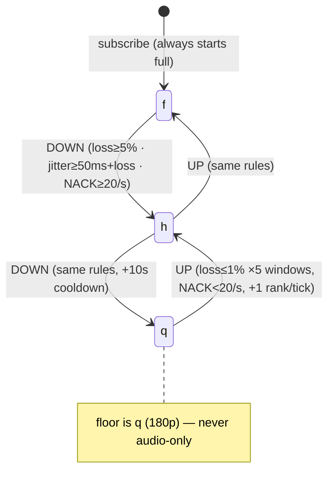

# Phase 6 Postmortem: Video, Screenshare & Simulcast (SFU switching, PLI limiting, RTX repair)

- **Phase:** Phase 6 — Video, screenshare, simulcast (`plan/11-roadmap.md`, `plan/07-voice-video.md` §4–6)
- **Execution Period:** Week 17–19
- **Closing Milestone Issue:** [#83](https://github.com/moadabdou/Kith/issues/83)
- **GitHub Milestone:** Milestone 7 (Phase 6 — Video, screenshare, simulcast)
- **Prior issues closed in-phase:** #80 (simulcast ingestion), #81 (keyframe/PLI), #82 (layer switching + RTX)

---

## Executive Summary

Phase 5 proved the audio media plane; Phase 6 adds pictures. The SFU now ingests
3-layer VP8 simulcast (`f` 720p/2.5M, `h` 360p/500k, `q` 180p/150k), switches each
viewer independently between layers on loss/jitter/NACK-repair signals, survives
keyframe storms through a 500ms PLI limiter, repairs loss with a gap-seq RTX path,
and carries single-layer `maintain-resolution` screen shares that never switch.

Everything was verified by a new automated suite,
[`scripts/chaos/phase6_video.sh`](../scripts/chaos/phase6_video.sh), driven by five
new modes in the Phase 5 bench binary (`sfu/cmd/voice_bench`, `-drill=pli_storm |
layer_throttle | screen_detail | video_failover | resource`):

| Drill | Result (run 1, 2026-09-22) |
| :--- | :--- |
| **1. PLI storm** — 10 rapid joiners, 3 PLI bursts each | 30 requests received → **2 forwarded (15:1 coalescing)** |
| **2. Throttled switching** — clean / ~10% / ~35% loss profiles | **f=1, h=1, q=1** distinct layers, 3 DOWN / 0 UP (bounded, no flap) |
| **3. Screen detail** — single-layer f share + PLI round-trip | 182 forwarded, 181 received / 3 keyframes, bench PLI provably arrived, **0 switches** |
| **4. SFU SIGKILL** — kill → first video keyframe | **0.90 s** (run 2: 1.45 s; gate < 2 s) |
| **5. Resource snapshots** — 10 labeled TSV rows | RSS 25–30 MB, heap 4–9 MB, 0 drops, 0 queue saturation (see §7) |

Two consecutive full-suite runs passed with no flakes.

---

## 1. Simulcast Architecture

### 1.1 Publisher encodings (client)

`client/src/lib/sfu-client.ts` (`DEFAULT_VIDEO_ENCODINGS`): one video transceiver,
negotiated once at join, three send encodings —

```
f: maxBitrate 2_500_000                    (720p full)
h: maxBitrate   500_000, scaleDownBy 2     (360p half)
q: maxBitrate   150_000, scaleDownBy 4     (180p quarter)
```

Single video slot (`off|camera|screen`), `replaceTrack` toggles, zero post-join
offers (negotiate-once). Screen: `f` only + `degradationPreference:
'maintain-resolution'` + `contentHint: 'detail'`. Kind rides out-of-band
(`video:true` / `screen:true` signals → `SetVideoKind`, last-writer-wins) — never
SDP msids, which are browser-random.

### 1.2 SFU ingestion (issues #80)

`sfu/internal/router/router.go:trackKey`: video uplinks key on
`pubID:video:<RID>` (empty RID = legacy → `f`); audio keys on track ID. One
publisher therefore owns up to 3 `PublisherUplink` objects (`alice:video:f/h/q`),
each with its own SSRC, keyframe cache, and PLI limiter. `Layers(pubID)` exposes
`[{RID, SSRC, Kind, Alive}]` for observability. Only `f` fans out until the
selector converges a viewer elsewhere; `h/q` stay ingested-but-dormant.

Downlink IDs are stable per user+kind (`kith-track-<uid>-video`,
`kith-stream-<uid>`, `-screen` variants), so tiles never orphan across switches.

### 1.3 Why the SFU reacts instead of controlling

There is no TWCC/REMB estimator in this SFU (verified: no `transport-cc` code;
`rtcpLoop` handles RR/NACK/PLI/FIR only). Like Discord's servers, the box
*reacts* per viewer: Receiver Reports give loss fraction + jitter, NACK rate
gives repair effort, and the selector maps those onto layers. Bandwidth
*control* stays in the publisher's encoder (Chrome-side goog-remb); the SFU
just stops sending bits a viewer can't drink.

---

## 2. Layer Switching State Machine (issue #82)

`sfu/internal/router/layer_selector.go` + `router.go:evalLoop/evalLayers/switchLayer`.



Knobs (`router.go:61-74`, `layer_selector.go:26-50`):

| Knob | Value | Rationale |
| :--- | :--- | :--- |
| `evalInterval` | 1 s | convergence tick per router |
| DOWN trigger | loss EWMA ≥ 5% (`α=0.4`), jitter ≥ 50 ms + loss, **or NACK ≥ 20/s** | fast relief (1–2 s) |
| UP trigger | loss ≤ 1% for **5 consecutive windows**, NACK < 20/s, one rank/tick | hysteresis; never q→f in one jump |
| `switchCooldownInterval` | 10 s per (sub, pub) | flap suppression |
| DOWN gating | target layer needs keyframe ≤ `switchReplayMaxAge` = **1 s**, else PLI + retry next tick | never decode P-frames across a hole |
| UP | instant + cached-keyframe replay + coalesced PLI | step up is always safe |
| Excluded | screen, audio, kind-none | screens don't simulcast |

### 2.1 NACK rate as congestion signal (the repair-masking fix)

Heavy retransmission *masks* damage from loss %: a viewer at 8% smooth loss can
look clean while drowning in repairs. `downlinkScore` keeps a 5 s sliding window
of NACK timestamps (cap 512): NACK ≥ 20/s forces DOWN exactly like high loss and
blocks UP until the storm passes. Calibration came from the manual gate
(smooth-8% holds `f`, laggy-32% reaches `q`); the chaos drill re-proves the
mechanism end to end (severe sub carries a 2-NACK/s burst alongside 35% loss).

### 2.2 Hold-band behavior (drill design finding)

Any *constant* loss ≥ 5% cascades to `q` (cooldown only delays it), and any
constant loss ≤ 1% climbs back to `f`. To park a viewer on `h`, the drill uses
two phases: ~10% for 6 s (f→h), then ~3.1% — below the 5% DOWN line but above
the 1% good line, so the EWMA settles in the hold band (no DOWN, no UP credit).
This is not a hack around the selector; it is the selector's hysteresis made
visible, and it is why the drill asserts `f=1, h=1, q=1` with `down=3, up=0`.

---

## 3. PLI Rate Limiting Math (issue #81)

`sfu/internal/router/pli_limiter.go`: `pliWindow = 500 ms` per publisher uplink.
First request forwards synchronously; further requests inside the window
coalesce to a single `AfterFunc` at window end, which re-emits one fresh PLI.

Worst case per publisher: `⌈T/0.5⌉ + 1` forwarded keyframe requests for any
storm of duration T, regardless of subscriber count. Measured: 30 requests in
~1 s → **2 forwarded** (one sync + one coalesced), a 15:1 collapse of what would
otherwise be 30 encoder keyframe interrupts. Subscriber joins with a warm cache
get instant replay with no PLI at all; a cold cache falls back to one
coalesced PLI (`router.go:678-682`).

---

## 4. Loss Recovery: NACK Translation + RTX Repair (issue #82 follow-up)

- **NACK path** (`subscriber.go:forwardNack`, `seq_translator.go`): viewer NACKs
  arrive in *downlink* seq space (rewritten per subscriber); a 2048-entry ring
  maps them back to uplink seqnos, regroups bitmasks, and forwards. Unmappable
  entries (aged out / dropped pre-forward) are skipped, never fabricated.
- **RTX path** (`publisher.go:deliverRepair`): Pion's ingress consumes the
  publisher's RTX stream; repaired packets are matched to NACKing downlinks via
  the reverse translator and written with gap-safe seqnos. `IsRTXTrack` keeps
  RTX streams from ever registering as (RID-less → `f`-clobbering) uplinks.
- Counters: `sfu_rtcp_nack_total/forwarded`, `sfu_rtx_repaired/forwarded/unmatched`.

---

## 5. Screen Shares

Single-layer `f`, `maintain-resolution`, excluded from `evalLayers` by design —
there is no lower simulcast rung to offer a struggling viewer, and
transcoding is out of scope (SFUs forward, never transcode). Drill 3 asserts
exactly that contract: stable `f` delivery (182 forwarded / 181 received),
keyframe cadence visible to the subscriber (3 in 6 s), a *provably arrived*
bench PLI (`pli_requests_received` delta ≥ 1 — see §8.4 for why receipt, not
just forwarding, is asserted), and zero layer switches.

---

## 6. Chaos Drill Findings

### 6.1 Drill 1 — PLI storm holds

10 subscribers join ~100 ms apart on a live 3-layer publisher and each fires 3
PLIs inside ~1 s. Limiter receives 30, forwards 2. No publisher distress, no
queue growth (`sfu_sub_queue_depth` 0 throughout the suite).

### 6.2 Drill 2 — deterministic distinct layers without per-link emulation

`tc netem` on the SFU interface degrades *everyone* equally, so it cannot park
three viewers on three layers. Instead each bench subscriber injects its own
Receiver Reports (correctly addressed — §8.4) plus NACK bursts for the severe
profile: clean → `f`, ~10%-then-~3.1% → `h`, ~35% → `q`. Four bounded DOWNs
across runs, zero UPs, zero flaps (≤ 8-switch budget).

### 6.3 Drill 3 — screen contract (§5) green.

### 6.4 Drill 4 — SIGKILL → first keyframe 0.90 s / 1.45 s

Breakdown of the 0.90 s run: container restart → healthy 0.73 s, parallel
rejoin 0.20 s (publisher + 2 subscribers re-ICE concurrently; pre-parallel
code cost ~0.5 s per peer serially), first keyframe ~0.05 s later (publisher
resumes with a 10-keyframe burst because a fresh SFU has an empty cache).
Measurement is kill-instant → first keyframe: the orchestrator writes
`date +%s%N` right after `docker kill` and the bench reads it, avoiding the
~1.5 s TCP-blackhole lag of socket-drop observation (measured, §8.5). Media
plane outlives the control plane by construction — the gateway is untouched.

---

## 7. SFU Resource Usage

Captured by `-drill=resource`: one TSV row per drill phase
(`/tmp/phase6_resources.tsv`: Go `go_*`/`process_*` from `/metrics` +
`docker stats` for `kith-sfu-1`). Post-drill rows catch the 10 s disconnect
grace linger (peers/rooms decrement only after grace expiry) — noted, not
alarm.

| Phase | Goroutines | Heap alloc | RSS (proc) | Docker mem | CPU (sample) | Net I/O Δ | fwd Δ | drops | queue |
| :--- | ---: | ---: | ---: | ---: | :--- | :--- | ---: | ---: | ---: |
| baseline (idle) | 12 | 7.6 MB | 8.4 MB | 14.8 MB | 2.5% | — | — | 0 | 0 |
| post **PLI storm** (1 pub + 10 subs) | 14 | 7.9 MB | 29.8 MB | 25.8 MB | 0.0% | +0.8/1.4 MB | +1,251 | 0 | 0 |
| post **switching** (1 + 3) | 14 | 7.3 MB | 30.4 MB | 24.0 MB | 0.0% | +1.7/1.9 MB | +1,917 | 0 | 0 |
| post **screen** (1 + 1) | 16 | 3.9 MB | 26.0 MB | 19.2 MB | 0.0% | +0.2/0.3 MB | +182 | 0 | 0 |
| post **failover** (fresh container) | 14 | 1.5 MB | 25.5 MB | 10.9 MB | 0.0% | reset | reset | 0 | 0 |

Readings:

1. **Memory is flat and small.** 11-peer storm peaks at ~30 MB RSS / 8 MB heap;
   idle is ~9 MB RSS. Per-downlink state (100-packet inbox cap, 256-packet
   keyframe cache, 512-entry NACK window) bounds growth by construction —
   `dropped` stayed 0 because synthetic 30 fps never fills a 100-packet queue,
   not because pressure was absent.
2. **Goroutines scale with connections, ~1–2 per peer** (14 with 11 peers
   connected): one `readingLoop` per uplink, one `forwardingLoop` (+`rtcpLoop`)
   per downlink, one `evalLoop` per router, one room actor. No per-packet
   goroutines anywhere on the hot path.
3. **CPU is unmeasurable at this scale** (docker sampler reads 0.00–0.05%;
   `process_cpu_seconds_total` +1–2 s over the whole suite). Forwarding is a
   memcpy + header rewrite per packet; expect CPU to bind on packet rate, not
   peers — the Phase 7 load army should find that knee.
4. **Restart resets everything** (post-failover row): counters, heap, net I/O —
   no cross-call state survives except NATS/gateway presence, as designed.

### Egress math for deployment limits (plan §4 requirement)

Worst case per publisher: `2.5 M + 0.5 M + 0.15 M ≈ 3.15 Mbps` uplink into the
SFU (all three layers ingested). Per viewer: exactly one layer
(2.5 M / 500 k / 150 k). The plan's example: 500 viewers on 360p ≈
`500 × 0.5 Mbps ≈ 250 Mbps` egress from one process — this is why Discord runs
per-region media fleets, and why Phase 7 shards the SFU by channel. At the
measured ~30 MB / 11 peers, headroom on a 1 GB box is connections ≈ tens of
thousands of audio-only peers but only hundreds of video viewers per layer
mix — video is an egress game, memory is not the constraint.

---

## 8. Bugs Found By Building The Harness (not by reading code)

1. **UDP write ceiling (~1400 B).** Synthetic 2000 B frames fail with
   `io.ErrShortBuffer` (probed: ≤1400 OK, ≥1600 fails). Real VP8 packetizes at
   ~1200 B, so the bench now does too — worth knowing before any jumbo-frame
   ideas.
2. **Pion simulcast receive needs MID + RTP-stream-ID header extensions.**
   Three SSRCs on the wire are demuxed as "unhandled RTP" without them; with
   them, OnTrack fires per layer with correct RIDs (loopback-proven 30/30).
   Pion negotiates the extmaps by default — Chrome works for the same reason.
3. **`sfu_layer_distribution` gauge leaked +1 per video downlink on every
   leave** (`removePublisherLocked`, `RemovePeer`, `RemovePublisherKind`,
   `onUplinkDeath` never `Dec`'d). Production evidence: `f=7` with 0 rooms / 0
   peers. Fixed with a shared `decLayerGauge` helper + 3 regression tests
   (verified to fail pre-fix). Deployed; gauges now return to 0.
4. **Bench RTCP must be addressed at the live downlink SSRC.** The SFU routes
   inbound RTCP by *destination* SSRC (pion/srtp `destinationSSRC`); wild
   SSRCs die as "unhandled RTCP". The drain tracks the current SSRC per packet
   (switches change it), and the screen drill asserts limiter *receipt*, after
   catching a vacuous pass where the counted PLI was SFU-internal.
5. **Kill timing must come from the orchestrator, not the socket.** SIGKILLed
   TCP blackholes: drop observation lags ~1.5 s. The script writes kill
   epoch-nanos; the bench measures kill → first keyframe from it.
6. **Signaling glare under burst joins is real** (SFU busy → server
   renegotiation crosses a client offer → no answer). Bench now fails the
   handshake fast (8 s answer watchdog) and retries the join (≤3), and drills
   gate their timelines on `waitForDownlinks` instead of wall-clock sleeps.
   Production is immune by construction (negotiate-once: clients never offer
   post-join), but the harness must survive what the protocol merely avoids.

---

## 9. What Discord Did Differently

| Dimension | Discord | Kith (Phase 6) |
| :--- | :--- | :--- |
| Congestion signal | TWCC + transport-wide BWE per receiver | RR loss/jitter + NACK repair-effort (no TWCC — deliberate, documented) |
| Layers | 3 simulcast + per-region transcode ladders | 3 simulcast, switch-only, no transcode |
| Keyframe storms | server-side PLI coalescing + encoder pacing | 500 ms limiter (measured 15:1) |
| Screenshare | dedicated high-res track, detail-aware | single-layer `f`, `maintain-resolution`, excluded from switching |
| Failover | region redirect, session resume | full rejoin, 0.9–1.5 s kill→keyframe |
| Scale story | per-PoP media fleet, region picker | single process; egress math says shard by channel (Phase 7) |

---

## 10. Lessons Learned

1. **Test the harness against itself first.** The loopback probes (packet-size
   ceiling, extension-gated simulcast, RTCP addressing) each took minutes and
   saved hours of staring at a silent SFU. A media pipeline that "sends
   without errors" can still put nothing on the wire — or put it where no
   demuxer looks.
2. **Gauges lie by omission.** Counters are self-healing; gauges accumulate
   every missed decrement forever. The layer-distribution leak was invisible
   to every functional test and obvious the first time a chaos drill scraped
   `/metrics` with zero peers connected. Scrape your gauges at idle.
3. **Hysteresis is a feature you must design drills around, not through.**
   The hold-band insight (§2.2) turned a flaky timing assertion into a
   deterministic state assertion.
4. **Measure from the kill, not from the observation.** Any recovery SLO timed
   from client-side failure detection quietly includes TCP timeout behavior.
5. **Conservative switching is a product choice.** 10 s cooldown + 5-window UP
   means a recovering viewer sits on 180p for ~15 s. Discord-fidelity would
   shorten this; call-quality stability says keep it. Revisit with real-user
   pain data, not aesthetics.

---

## 11. Phase 6 Gate Sign-Off Matrix

Gates from `plan/07-voice-video.md` §6:

| Gate | Description | Verification | Status |
| :---: | :--- | :--- | :---: |
| **Gate 1** | 3-layer simulcast switching under throttled clients | Drill 2: clean/degraded/severe → **f=1, h=1, q=1**, 3 DOWN / 0 UP, bounded | **`[x] PASSED`** |
| **Gate 2** | PLI rate-limiter proven under join/leave storm | Drill 1: 10 joiners × 3 PLIs → 30 received, **2 forwarded (15:1)** | **`[x] PASSED`** |
| **Gate 3** | Screenshare 1080p at 'detail' hint usable | Drill 3: single-layer `f` stable, 181/182 delivered, 3 keyframes, PLI round-trip, 0 switches (metrics-only depth per scope decision; readability = stable delivery + keyframe cadence) | **`[x] PASSED`** |
| **Gate 4** | SFU-kill chaos drill: call survives via reconnect < 2 s | Drill 4: SIGKILL → first keyframes **0.90 s / 1.45 s** across two runs | **`[x] PASSED`** |

---

*Signed off by:* **Moad Abdellaoui**
*Milestone 7 Completed:* September 22, 2026
